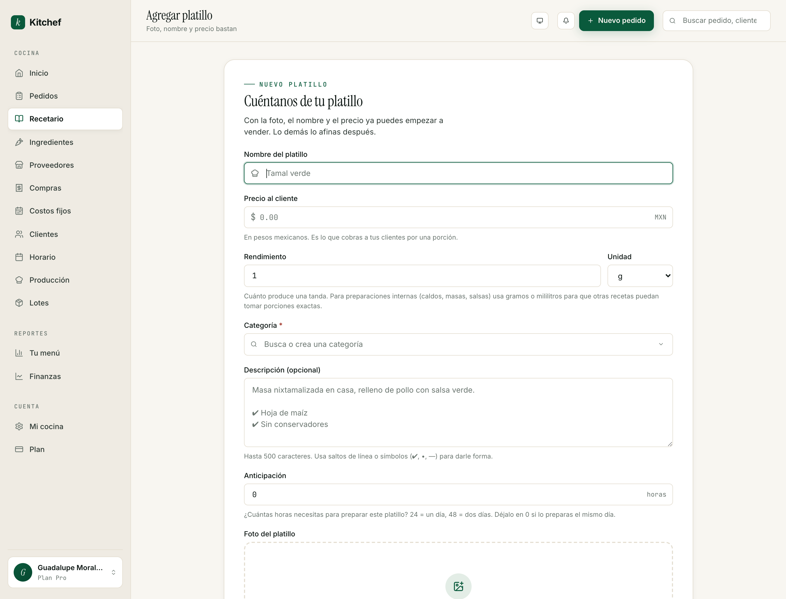

# 1 · Bienvenida y primeros pasos

[← Volver al índice](README.md) · Siguiente: [Tu cocina pública →](02-cocina-publica.md)

---

## ¿Qué es Kitchef?

Kitchef es el sistema operativo de tu cocina. En un solo lugar tienes
tu menú público, tus pedidos, tus cobros, tu producción del día y
tus números. Está hecho en español, en pesos mexicanos, sin comisión
por venta.

No es un Uber Eats, ni un Rappi. No te conecta con clientes nuevos
que no conozcas — eso lo sigues haciendo tú por WhatsApp, Instagram,
boca a boca. Lo que Kitchef hace es **tomar el papelito, los chats y
los Excel sueltos** y juntarlos en una sola libreta digital, lista
para tu celular.

## ¿Para quién es?

Para una sola persona que cocina y vende lo que cocina. Tres
escenarios típicos:

- **Cocina casera con entrega los jueves y sábados.** Vendes a
  vecinos y conocidos. Antes anotabas en una libreta o en notas del
  celular.
- **Repostera o panadera por encargo.** Tu cliente te pide con días
  de anticipación; tú avisas cuando está listo y coordinas entrega o
  recolección.
- **Cocina oscura o "dark kitchen".** Operas desde un local sin
  comedor. Tus pedidos llegan por mensaje y los entregas a domicilio.

Si tu cocina tiene varios empleados, varios locales, o más de 200
pedidos al día, Kitchef te va a quedar chico. Avísanos cuando llegues
a ese punto y te ayudamos a planear.

## Lo que vas a necesitar

- Un celular o computadora con internet.
- Un teléfono de WhatsApp con el que tus clientes te puedan localizar.
- Por lo menos **un platillo con foto y precio** para arrancar.
- (Opcional pero recomendado) Una dirección de recolección si tus
  clientes pasan por sus pedidos.

No necesitas tarjeta de crédito para empezar. La cuenta gratuita te
permite hasta 20 pedidos al mes; cuando los rebases te invitamos a
pasarte al plan Pro ($150 MXN al mes, sin contrato).

## Tu panel — un recorrido rápido

Cuando entras a `kitchef.mx` con tu correo y contraseña, llegas a tu
**Inicio** (`/`). Ese es tu tablero del día.


Vas a ver tres bloques principales:

- **Esta semana** — cuánto vendiste, cuántos pedidos, tu margen, y un
  comparativo con la semana pasada.
- **Pedidos de hoy** — los pedidos cuya fecha de entrega es hoy, con
  su estado y total.
- **Tu menú** — tus platillos publicados, lo que tus clientes ven en
  tu storefront.

A la izquierda hay un **menú lateral** organizado en tres bloques:

### Bloque "Cocina"
Las pantallas del día a día.
- **Inicio** — tu tablero rápido.
- **Pedidos** (`/orders`) — el kanban donde vives el día.
- **Recetario** (`/recipes`) — todo lo que cocinas.
- **Ingredientes** (`/ingredients`) — tu despensa, con precios.
- **Proveedores** (`/suppliers`) — quién te vende qué.
- **Compras** (`/purchases`) — el ledger de lo que has comprado.
- **Costos fijos** (`/fixed-costs`) — renta, gas, plataformas.
- **Clientes** (`/clients`) — tu agenda de clientes.
- **Horario** (`/schedule`) — cuándo aceptas pedidos.
- **Producción** (`/production`) — qué cocinar hoy y la lista de compras de la semana.
- **Lotes** (`/batches`) — sólo aparece si activaste el inventario (capítulo 10).

### Bloque "Reportes"
Las pantallas para entender cómo va tu negocio.
- **Tu menú** — qué platillo te deja más, cuáles vender más.
- **Finanzas** — ventas, costos, utilidad neta.

### Bloque "Cuenta"
- **Mi cocina** (`/account/edit`) — toda tu configuración pública y privada.
- **Plan** (`/subscription`) — Gratis o Pro.

> **Tip:** Cada vez que veas una sección nueva en el menú, abre la
> primera vez sin presionar nada — sólo a ver qué hay. Vas a sentirte
> mucho más en confianza después.

## Tu primera media hora — paso a paso

Si acabas de crear tu cuenta, esto es lo mínimo para tener tu cocina
funcionando. Lo demás puede esperar.

### Paso 1 — Pon tu nombre y tu frase corta · 2 min
1. Ve a **Mi cocina** (`/account/edit`).
2. En la sección **Identidad**, escribe el nombre de tu cocina.
3. Pon una **frase corta** que diga qué cocinas. Ejemplos:
   - *"Tamales, pasteles y meal-prep · Condesa"*
   - *"Comida casera sonorense · Villa de Seris"*
   - *"Postres por encargo · Providencia"*
4. Más abajo escribe una **descripción** de 2-3 líneas. Cuenta quién
   eres, qué cocinas y por qué. Tu cliente la va a leer en tu menú
   público.

Cada cambio se guarda solo. No hay botón de "Guardar" — verás un
chip de "Guardado" cuando termina de procesarse.

### Paso 2 — Sube logo y portada · 3 min
En la misma pantalla:
1. **Logo** — una imagen cuadrada o circular. Si no tienes una,
   sirve una foto de tu platillo estrella o tus iniciales bonitas.
2. **Portada** — una foto horizontal que represente tu cocina. Una
   bandeja de tamales, tu mesa de trabajo, el atardecer desde la
   ventana de tu cocina. La que sientas más tuya.

Formatos aceptados: JPEG, PNG, WebP, HEIC. Hasta 5 MB cada una.

### Paso 3 — Elige tus colores · 1 min
Más abajo, en **Color principal**, elige una paleta. Hay como diez,
todas pensadas para verse bien en claro y oscuro. La que sientas más
tuya. La puedes cambiar después en cualquier momento.

### Paso 4 — Tu primer platillo · 5 min



1. Ve a **Recetario** (`/recipes`) y presiona **Agregar platillo**.
2. Escribe el nombre. Por ejemplo *"Tamales verdes (docena)"*.
3. Pon el precio en pesos.
4. Sube por lo menos una foto. Sin foto no se puede publicar.
5. Si tu platillo necesita avisarse con anticipación (un pastel, una
   olla de pozole), pon las **horas mínimas de anticipación**.
6. Guarda. De vuelta en **Recetario**, presiona **Publicar en mi tienda**.

Ya tienes tu primer platillo en línea. Si vas a `kitchef.mx/tu-cocina`
desde otro navegador (o de incógnito), lo vas a ver.

### Paso 5 — Configura cómo te pagan · 3 min
1. Vuelve a **Mi cocina** y baja a la sección **Pagos**.
2. Marca los métodos que aceptas:
   - **Efectivo** — tu cliente paga al recibir.
   - **Transferencia (SPEI)** — necesitas tu CLABE de 18 dígitos.
   - **Tarjeta** — coordinas el cobro tú (link de Mercado Pago o similar).
3. Si activas **transferencia**, escribe el titular, banco y CLABE.
4. Si activas **propinas**, deja los porcentajes sugeridos (10/15/20)
   o ajústalos.

### Paso 6 — Cuándo recibes pedidos · 2 min
1. Ve a **Horario** (`/schedule`).
2. Marca los días de la semana en los que aceptas pedidos.
3. Para cada día, indica el rango de **ventanas de entrega** (por
   ejemplo, sábado de 11:00 a 15:00).
4. Pon un **tiempo mínimo de anticipación** si aplica (por ejemplo, 2
   horas para pedir; o "el día anterior" para pedidos para mañana).

### Paso 7 — Comparte tu link · 1 min
Tu link público es:

```
kitchef.mx/<tu-slug>
```

Por ejemplo: `kitchef.mx/cocina-de-elena`. Ese link es tu menú
público — pónlo en tu bio de Instagram, mándalo por WhatsApp,
imprímelo en una tarjetita pegada al refrigerador.

> El **slug** lo elegiste cuando te registraste. Si quieres cambiarlo
> después, contacta soporte — los links viejos dejarían de funcionar
> y no queremos que pierdas a un cliente.

## Próximos pasos

Con esto ya tienes una cocina funcional. Cuando estés lista para
profundizar:

- **[Capítulo 2 — Tu cocina pública](02-cocina-publica.md)** explica a
  fondo cómo cuidar la imagen de tu tienda (descripción larga, zonas
  de entrega, dirección de recolección, mapa).
- **[Capítulo 3 — Tu menú](03-menu.md)** te lleva por el recetario
  completo: cómo organizar por categorías, cómo manejar platillos
  internos, cuándo despublicar, cómo duplicar.
- **[Capítulo 7 — Pedidos](07-pedidos.md)** es el más importante para
  el día a día. Léelo antes de tu primera semana real.

## Lo que NO necesitas hacer todavía

Para no abrumarte, **no toques nada de esto** en tu primera semana:

- **Ingredientes y costos** (capítulo 5) — sirve para calcular
  márgenes finos. Si no tienes 30 minutos para sentarte a capturar
  tu despensa, déjalo para después.
- **Lotes / Inventario** (capítulo 10) — control de cuánto cocinaste
  vs cuánto vendiste. Útil cuando tu volumen ya pesa; en tus primeras
  semanas es ruido.
- **Recetas avanzadas** (capítulo 4) — descomposición en ingredientes.
  Sirve para reportes de margen y para inventario; no es necesario
  para vender.

Kitchef está diseñado para que estas funciones aparezcan cuando las
necesites, no antes. Confía en que tus primeros pedidos se pueden
manejar con sólo lo que vimos aquí arriba.

---

[← Volver al índice](README.md) · Siguiente: [Tu cocina pública →](02-cocina-publica.md)
