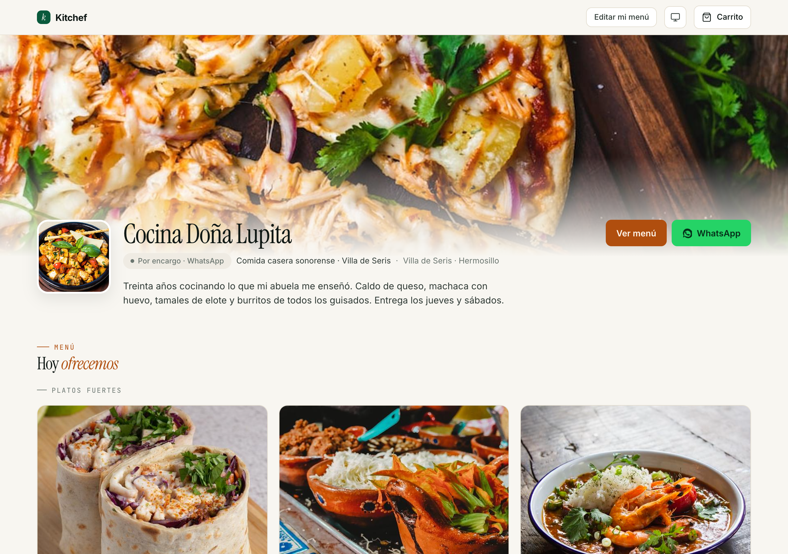
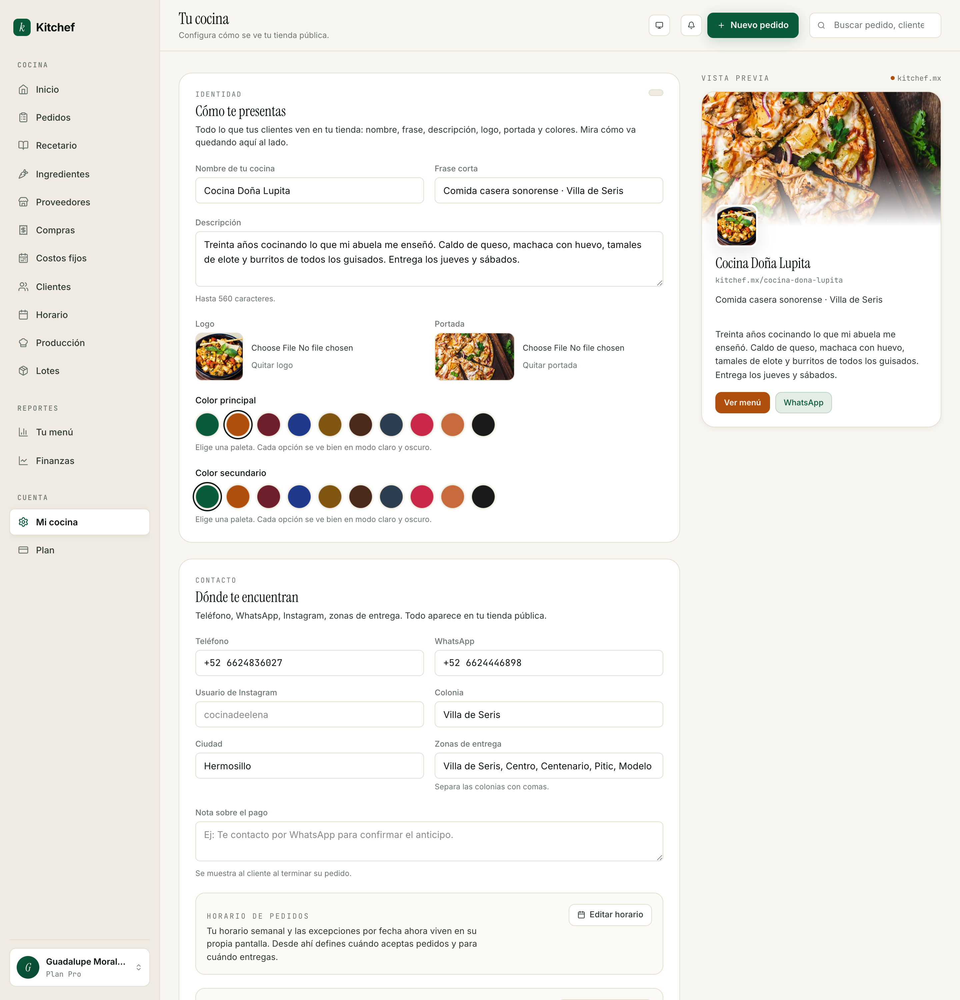
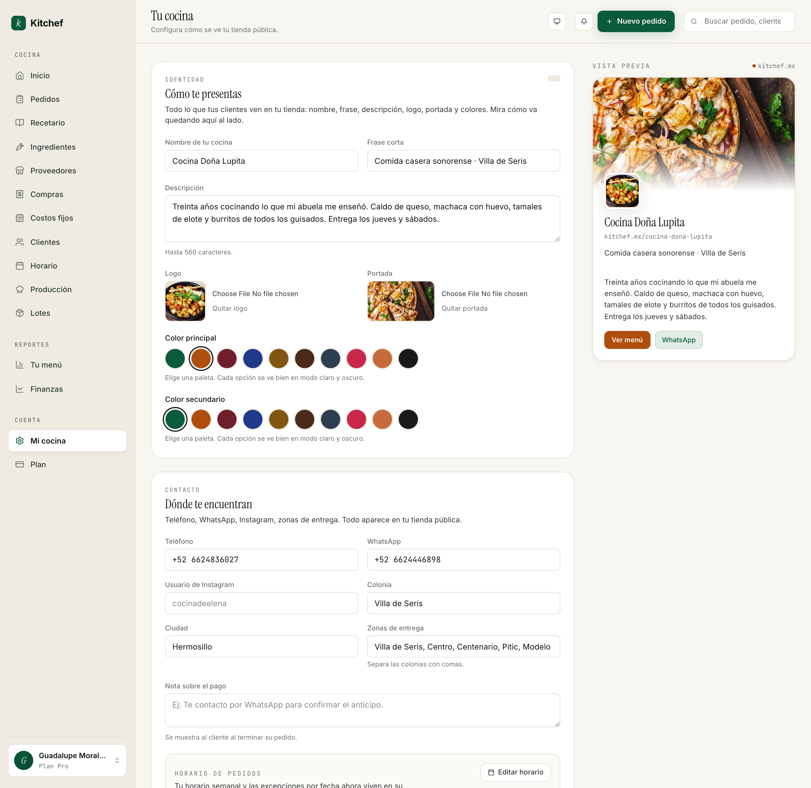

# 2 · Tu cocina pública

[← Volver al índice](README.md) · Anterior: [Bienvenida](01-bienvenida.md) · Siguiente: [Tu menú →](03-menu.md)

---

## Para qué sirve

Tu cocina pública es lo que tus clientes ven antes de pedirte. Es
tu cara: el nombre, la foto, los colores, la dirección, los métodos
de pago. Si tu storefront se ve bien cuidado, los clientes piden
con confianza. Si se ve hecho a medias, dudan.

Así se ve tu storefront cuando alguien entra a `kitchef.mx/<tu-slug>`:

Cada elemento de esa pantalla — la portada de fondo, el logo, el
nombre, la frase corta debajo, los chips de ubicación, el párrafo
de descripción, los colores de los botones — sale de la
configuración que vas a hacer en este capítulo.

Toda la configuración vive en una sola pantalla — **Mi cocina**
(`/account/edit`). Son varias secciones; las cubrimos una por una.

## Cuándo usarla

- **Al empezar** — los primeros 30 minutos (capítulo 1).
- **Cuando cambias algo** — nuevo logo, nueva paleta, agregaste
  WhatsApp Business.
- **Estacional** — antes de Navidad cambias la portada a una foto
  de tamales navideños; en cuaresma a una de capirotada.

No es una pantalla diaria.

## El truco de la vista previa

A la **derecha** de la pantalla siempre tienes una **vista previa
en vivo** de tu storefront. Cualquier cambio que haces en el
formulario de la izquierda se refleja al instante. Sin guardar, sin
recargar, sin abrir otra pestaña.

Eso significa que puedes:
- Probar tres logos sin "publicar" cada uno.
- Cambiar de paleta y ver al instante cómo cambia el ánimo.
- Ajustar la descripción y ver cómo se acomoda en la tarjeta.

Cuando estés conforme, simplemente sales de la pantalla — los
cambios ya están guardados. **No hay botón de "Publicar"**: el
guardado es automático (autosave). Verás un chip *"Guardado"* arriba
cuando termina de procesarse.

## Sección "Identidad"

Lo más visible del storefront.

### Nombre de tu cocina
Cambia tu nombre comercial. **Ojo:** esto **no** cambia tu URL.
Tu slug (la parte después de `kitchef.mx/`) se queda fijo desde el
registro. Si necesitas cambiar el slug, contacta soporte.

### Frase corta
Una línea, máximo unas 60-80 caracteres. Aparece arriba de la
tarjeta de tu storefront. Ejemplos:

- *"Tamales, pasteles y meal-prep · Condesa"*
- *"Comida casera sonorense · Villa de Seris"*
- *"Pastelería artesanal · Providencia"*

Una buena frase corta dice **qué** vendes y **dónde** estás. Tres
palabras y una colonia: ya está.

### Descripción
Dos o tres líneas. Es lo que el cliente lee antes de tocar
"Ver menú". Cuenta:
- Quién eres.
- Qué cocinas.
- Por qué — un detalle personal funciona muy bien (*"treinta años
  cocinando lo que mi abuela me enseñó"*).

Hasta 600 caracteres. La preview de la derecha te muestra cuánto
espacio tomas.

### Logo
Imagen cuadrada o circular. Aparece en:
- El header de tu storefront público.
- El correo de confirmación que reciben tus clientes.
- El recibo y la página de pedido.

Si no tienes uno: tus iniciales en una tipografía bonita funcionan.
Hay servicios gratuitos como Canva con plantillas de logos para
restaurantes.

Formatos: JPEG, PNG, WebP, HEIC. Hasta 5 MB.

### Portada
Imagen horizontal. Aparece como banner arriba del menú. Una bandeja
de tu platillo estrella, una foto de tu cocina, un atardecer con la
ventana abierta. Lo que sienta tuyo.

### Colores (paletas)
Dos paletas:
- **Color principal** — los botones, los links, los acentos. Es la
  energía visual.
- **Color secundario** — sutilezas, fondos suaves, separadores.

Hay como diez paletas curadas. Todas funcionan en claro y oscuro.
Toca una y la preview de la derecha cambia al instante.

> **Tip:** No elijas la paleta que más te gusta a ti — elige la que
> mejor se vea con tu logo y tus fotos. Si tu logo es rojo, el verde
> bosque le va bien. Si tu logo es café, terracota refuerza el tono.

## Sección "Métodos de entrega"

Antes de que tu tienda pueda recibir pedidos, necesitas activar
**al menos un método de entrega**. Si no lo haces, tu storefront
muestra un aviso y el checkout queda bloqueado.

- **Recolección** — el cliente pasa por su pedido a tu cocina.
- **Entrega a domicilio** — tú llevas el pedido.

Puedes activar ambos. El cliente elige cuál al momento de hacer su
pedido.

> **Importante:** Este paso es obligatorio. Sin un método de
> entrega activado, tus clientes ven tu menú pero **no pueden
> ordenar**.

## Sección "Contacto"

Cómo tus clientes te encuentran.

- **Teléfono** — el número de cocina o personal que aceptas para
  llamadas. Aparece en la tarjeta del storefront.
- **WhatsApp** — el número de WhatsApp Business o personal. Si lo
  llenas, aparece un botón "Mandar WhatsApp" en cada confirmación
  de pedido — el cliente puede contactarte con un toque.
- **Instagram** — sólo el usuario, sin el `@`. Te ponemos un ícono
  de Instagram en el header.
- **Colonia** y **Ciudad** — para que tus clientes sepan de qué
  zona eres aunque no compartas dirección exacta.
- **Zonas de entrega** — colonias separadas por coma. Aparecen en
  tu tarjeta como "Entrego en: Condesa, Roma, Del Valle". No es un
  filtro estricto — es informativo. Si entregas a otra colonia, el
  cliente igual puede pedir.
- **Nota sobre el pago** — texto libre que aparece al final del
  checkout. Útil para *"Te contacto por WhatsApp para confirmar el
  anticipo"* o cosas similares.

## Sección "Recolección" (opcional)

Para cocinas a las que **el cliente pasa por sus pedidos**.

1. Activa **Mostrar mi dirección en el menú público** si quieres
   que tu calle sea visible. Si lo apagas, sólo los clientes que
   ya hicieron un pedido para recolección la ven.
2. **Calle y número** — empieza a escribir y aparecen sugerencias
   de Google Maps. Elige una para que se ubique exacta.
3. El **mapa** abajo se actualiza al instante. Puedes arrastrar el
   marcador si la dirección está mal ubicada.
4. **Abrir en Google Maps** — link directo para tus clientes.

Si **no** ofreces recolección, deja la sección vacía.

## Sección "Pagos"

Capítulo completo en [Tu plan de cobros (próximamente)] pero un
resumen rápido:

- **Acepto efectivo** — el cliente paga al recibir.
- **Acepto transferencia (SPEI)** — necesitas titular, banco y
  CLABE de 18 dígitos. Tu CLABE aparece en cada confirmación de
  pedido.
- **Acepto tarjeta** — coordinas tú el cobro (link de Mercado Pago,
  Stripe, etc.). Pones las instrucciones en el campo de texto.
- **Acepto propinas** — activa para que en el checkout aparezcan
  porcentajes sugeridos (10/15/20 por defecto, los puedes
  cambiar). El cliente puede dejar otra cantidad libre o ninguna.

> **Importante:** Kitchef **no procesa el pago**. Sólo lo registra.
> Tú coordinas con el cliente cómo cobrar; nosotros ayudamos
> mostrándole tus datos y llevándote el control.

## Funciones avanzadas

Una sección adicional al final que arranca **plegada**. Por ahora
contiene un solo switch:

- **Inventario y lotes** — capítulo 10. Déjalo apagado el primer mes.

## Errores comunes

| Pasó esto | Hacer esto |
|---|---|
| Mi tienda dice que no puedo recibir pedidos. | Activa al menos un **método de entrega** (recolección o domicilio) en la sección correspondiente. Sin eso, el checkout queda bloqueado. |
| Cambié mi nombre y la URL no cambió. | Es normal — la URL queda fija desde el registro. Pide a soporte si necesitas cambiarla. |
| Mi logo se ve cortado en la preview. | Está hecho para imágenes cuadradas. Si tu logo es horizontal, agrégale espacio en blanco arriba/abajo en Canva o similar antes de subirlo. |
| El mapa no me deja arrastrar el alfiler. | Recarga la página. Si persiste, es probable que falte la API de Google — avisa a soporte. |
| Cambié de paleta y mis fotos se ven raras. | Las paletas no afectan tus fotos, sólo los acentos. Si crees que sí, prueba en otro navegador o modo incógnito. |
| Subí la portada al revés. | Edita la imagen original (rotarla en Vista Previa de Mac o Fotos del celular) y vuelve a subirla. |

## Lo que NO necesitas tocar

- **Latitude / Longitude** — se llenan solos cuando capturas tu
  dirección. No los toques manualmente.
- **show_pickup_address** si no ofreces recolección. La dirección
  no se muestra a clientes que no han pedido.
- **default_packaging_cents** si tu empaque es gratis. Lo activas
  cuando empieces a cobrar empaque por separado.

## Próximos pasos

- **[Capítulo 3 — Tu menú](03-menu.md)** — sin platillos no hay
  cocina. Empieza por ahí.
- **[Capítulo 6 — Horario](06-horario.md)** — define cuándo
  aceptas pedidos.

---

[← Volver al índice](README.md) · Anterior: [Bienvenida](01-bienvenida.md) · Siguiente: [Tu menú →](03-menu.md)
