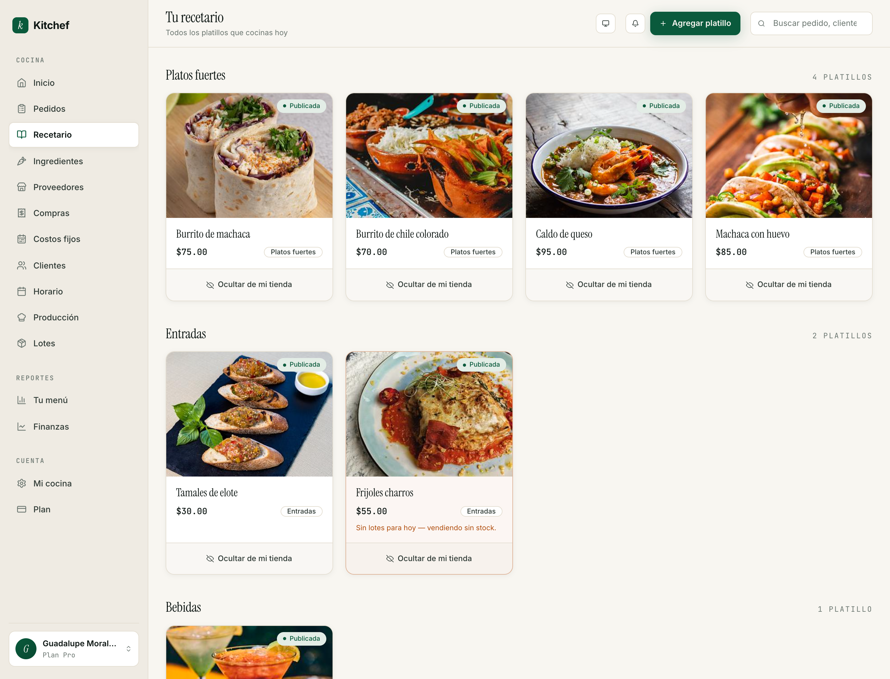

# 3 · Tu menú

[← Volver al índice](README.md) · Anterior: [Tu cocina pública](02-cocina-publica.md) · Siguiente: [Recetas avanzadas →](04-recetas-avanzadas.md)

---

## Para qué sirve

Aquí vives todo lo que cocinas. Cada platillo es una **receta** con
nombre, foto, precio y categoría. Las que están publicadas aparecen
en tu menú público; las que no, sólo las ves tú.

Hay dos modos de trabajar:

- **Modo simple** — el que viene activado por defecto. Cada receta es
  un platillo terminado: nombre, precio, foto. Sin desglose de
  ingredientes. Es lo que necesitas el primer mes.
- **Modo avanzado** — descomposición. Cada platillo se arma con
  ingredientes y/o sub-recetas; Kitchef calcula el costo y el
  margen. Esto se cubre en el [capítulo 4](04-recetas-avanzadas.md).

Este capítulo se enfoca en el modo simple. Es 100% suficiente para
arrancar.

## Cuándo usarla

- **Cuando agregas un platillo nuevo.**
- **Cuando subes el precio** porque cambió tu insumo.
- **Cuando quieres ocultar algo** (se acabó la temporada de
  capirotada, regresa en cuaresma).
- **Cuando quieres archivar** algo que ya no haces.

No es una pantalla diaria como Pedidos — es más bien semanal o
quincenal.

## El recetario

Las recetas se agrupan en **categorías** (Platos fuertes, Entradas,
Postres, Bebidas, Bases y preparaciones, Otros). Cada platillo es
una tarjeta con foto, nombre, precio, y un botón **Publicar /
Ocultar de mi tienda**.

Una tarjeta puede estar en uno de tres estados visuales:

- **● Publicada** (chip verde) — en vivo en tu tienda pública.
- **● Borrador** (chip gris) — sólo tú la ves.
- **Interna** (chip neutro) — es una receta base que se usa como
  componente de otras (no se vende sola). Más en el capítulo 4.

## Agregar tu primer platillo

1. Botón **Agregar platillo** arriba a la derecha.
2. **Nombre** — como quieres que aparezca en el menú público. Sé
   específica: *"Tamales verdes (docena)"* es mejor que *"Tamales"*.
3. **Categoría** — escoge una existente o crea una nueva escribiendo
   el nombre en el combobox.
4. **Precio de venta** — en pesos.
5. **Foto** — sube por lo menos una. Sin foto no se puede publicar.
   Cuadrada o rectangular, hasta 5 MB.
6. **Tiempo de anticipación** (opcional) — si necesitas que te
   pidan con horas de aviso (un pastel de cumpleaños, una olla de
   pozole), pon el número de horas. Tu cliente verá una etiqueta
   "Pedir con 4 horas de anticipación" y la fecha mínima del picker
   se ajusta sola.
7. **Descripción** (opcional) — dos o tres líneas de qué lleva o
   por qué es especial.
8. **Empaque** (opcional) — si tu platillo tiene un costo de
   empaque distinto al estándar (la caja de un pastel, por ejemplo),
   escríbelo aquí.

Guarda. Vuelves al recetario y la tarjeta está como **Borrador**.

## Publicar el platillo

En la tarjeta del recetario, presiona **Publicar en mi tienda**.

> Si no aparece el botón y en su lugar dice "Agrega una foto para
> publicar" — sí, eso. Sin foto no publicamos para que tu menú
> público nunca tenga huecos.

Para ocultarlo después, el mismo botón cambia a **Ocultar de mi
tienda**.

## Cambiar el precio

1. Abre la receta (toca la tarjeta).
2. Cambia el campo **Precio de venta**.
3. Guarda.

El precio nuevo aparece en tu menú público inmediatamente. **Los
pedidos ya existentes mantienen el precio que tenían cuando los
capturaron** — Kitchef no reescribe el pasado.

> **Tip:** Si quieres un precio que sea fácil de cobrar en efectivo
> (sin centavos), redondea hacia arriba. La diferencia se vuelve
> tu propina implícita.

## Foto: qué funciona

- **Luz natural.** Toma tu platillo cerca de una ventana, no debajo
  del foco.
- **Plato sencillo.** El platillo es la estrella; el plato es el
  marco.
- **De arriba o 45°.** Las dos funcionan. Las dos son mejor que la
  foto desde sentada.
- **Recortada cuadrada.** Tu menú las muestra en formato 4:3 — si
  subes una vertical larga se ve OK, pero la cuadrada se ve mejor.

Ejemplos de buenas fotos: el platillo cocinado, en su plato final,
con un detalle al lado (una salsa, una flor, las tortillas calientes).

## Cantidad de fotos

Puedes subir varias por receta — la primera es la portada, las demás
se muestran en la página de detalle del platillo. Una sola foto está
perfecto para empezar.

## Categorías

Las categorías agrupan tus platillos en el menú público. Por defecto
vienen seis:

1. **Platos fuertes** — comida principal.
2. **Entradas** — antes del plato fuerte.
3. **Postres** — los dulces.
4. **Bebidas** — aguas, cafés, lo que se toma.
5. **Bases y preparaciones** — recetas internas que no se venden
   solas. Si activaste modo avanzado, las salsas, masas, caldos van
   aquí.
6. **Otros** — todo lo que no encaja.

Para crear una categoría nueva: en el formulario de la receta, en el
campo **Categoría**, escribe el nombre que quieres y presiona ↵.
Aparece en el listado y se queda guardada.

Para borrar una categoría que ya no usas — no se puede directamente
si tiene recetas dentro. Mueve primero las recetas a otra y luego
bórrala desde la consola (o pídenos).

## Duplicar una receta

¿Vas a vender pastel de chocolate y pastel de zanahoria con el mismo
formato y precio? Duplica:

1. Abre la receta original.
2. Botón **Duplicar** arriba a la derecha.
3. Cambia el nombre, sube otra foto, ajusta lo que aplique.
4. Publica.

Útil también para versiones (chico / grande), para hacer ofertas
temporales, etc.

## Archivar y restaurar

Si quieres que una receta desaparezca del recetario sin perderla:

1. Abre la receta.
2. Baja a **Eliminar receta**.
3. Confirma.

La receta se mueve a **Archivados** (link al pie del recetario). Ahí
puedes verla y, si la quieres de regreso, presionar **Restaurar**.

Las recetas archivadas:
- No aparecen en tu tienda pública (se despublican automáticamente).
- No aparecen en el formulario de captura de pedidos.
- **Sí** mantienen su historial — los pedidos viejos que la
  contenían siguen mostrándola correctamente.

## Cuándo pasarte a modo avanzado

Quédate en modo simple si:
- Tienes menos de 10 platillos.
- No estás midiendo márgenes.
- Tu cocina cambia de mes a mes.

Pásate a modo avanzado si:
- Tienes >15 platillos y quieres ver cuál te deja más.
- Estás subiendo precios y quieres saber cuál margen mantener.
- Quieres activar inventario (capítulo 10).
- Tu menú es estable: las mismas 8-12 recetas con sus mismos
  ingredientes.

El modo avanzado se activa solo la primera vez que descompones una
receta — Kitchef lo detecta y te pregunta. O lo activas tú desde
el menú de cualquier receta con el botón **Descomponer en
ingredientes**. Ver [capítulo 4](04-recetas-avanzadas.md).

## Lo que NO necesitas tocar

- **Margen objetivo** — sólo importa cuando descompones la receta.
  En modo simple, el margen lo calculas tú a ojo (precio - lo que
  te costó).
- **Yield (rendimiento)** — `1 porción` por defecto está bien. Sólo
  importa para recetas base/internas.

## Errores comunes

| Pasó esto | Hacer esto |
|---|---|
| El platillo no aparece en mi tienda. | Revisa que esté **Publicada** (chip verde en la tarjeta) y que tu **Horario** acepte pedidos para hoy. |
| Subí la foto y se ve cortada. | Si la foto es muy vertical, recórtala a cuadrada antes de subir. |
| Quiero borrar una receta que tiene pedidos viejos. | Archívala en lugar de borrarla. Los pedidos viejos siguen referenciándola sin problema. |
| El cliente quiere "sin cebolla" pero el platillo no lo permite. | Necesitas activar **opciones** en la receta. Capítulo 4. |

## Próximos pasos

- **[Capítulo 7 — Pedidos](07-pedidos.md)** si quieres ver cómo se
  reciben los pedidos que llegan a tu menú.
- **[Capítulo 4 — Recetas avanzadas](04-recetas-avanzadas.md)** para
  descomponer en ingredientes y empezar a calcular costos.
- **[Capítulo 8 — Tu tienda en vivo](08-tienda.md)** para ver el
  recetario *como lo ven tus clientes*.

---

[← Volver al índice](README.md) · Anterior: [Tu cocina pública](02-cocina-publica.md) · Siguiente: [Recetas avanzadas →](04-recetas-avanzadas.md)
