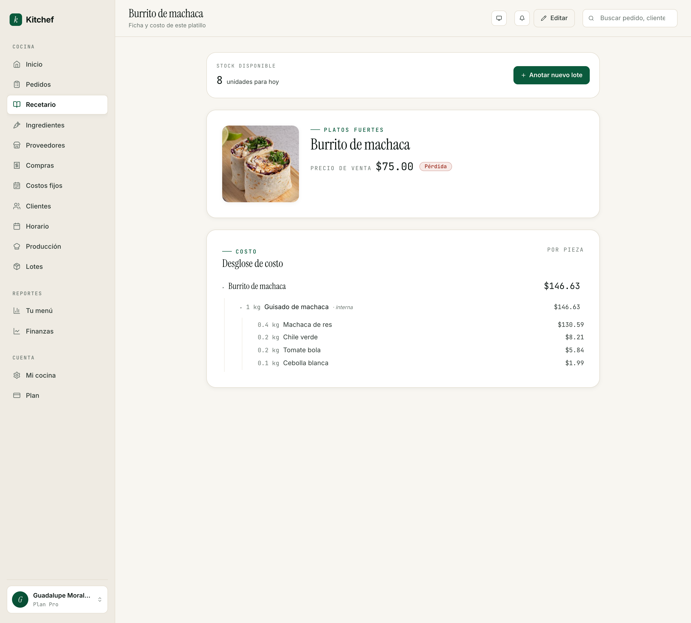
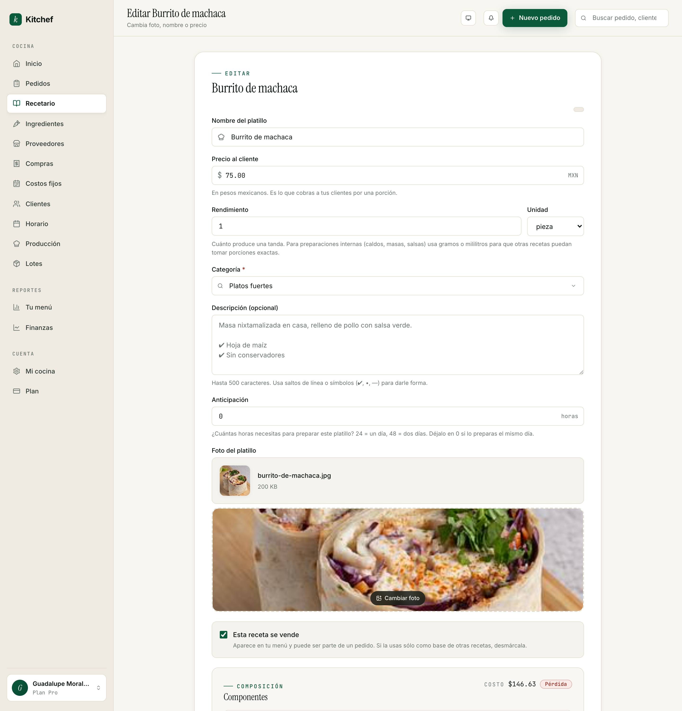

# 4 · Recetas avanzadas

[← Volver al índice](README.md) · Anterior: [Tu menú](03-menu.md) · Siguiente: [Ingredientes y costos →](05-ingredientes-y-costos.md)

---

## Para qué sirve

En modo simple, una receta es nombre + foto + precio. En modo
avanzado, una receta se **arma con piezas**: ingredientes
(harina, leche, machaca) y/o sub-recetas (la salsa verde, la masa
para tamales, el mole base).

Hacer eso te da tres cosas:

1. **Costo real.** Kitchef calcula cuánto te cuesta cada platillo
   sumando lo que pagaste por cada ingrediente. Sabes tu **margen**
   real, no a ojo.
2. **Lista de compras inteligente.** En lugar de "necesito hacer
   tamales para 30 pedidos", la pantalla de Producción te dice
   "compra 4 kg de harina, 2 kg de manteca, 800 g de queso".
3. **Inventario.** Cuando cocinas un lote (capítulo 10), Kitchef
   resta automáticamente los ingredientes de tu despensa.

## Cuándo usarla

- **Cuando tu menú es estable.** Si cambias platillos cada semana,
  descomponer cada uno es trabajo perdido.
- **Cuando quieres entender márgenes.** Por ejemplo, descubrir que
  el pastel tres leches te deja 65% pero los tamales sólo 30%.
- **Antes de activar inventario.** El inventario funciona bien sólo
  con recetas descompuestas.

Si tu menú es muy dinámico o estás empezando, mantente en modo
simple unas semanas más.

## Activar el modo avanzado

Pasa de dos formas:

1. **Automático**: la primera vez que descompones una receta,
   Kitchef detecta y activa el modo avanzado para tu cuenta.
2. **Onboarding**: durante el registro tienes la opción "Ya
   trabajo con costos detallados — quiero modo avanzado".

Una vez activo, en cada receta aparece la sección **Componentes**
abajo del precio.

## Cómo se ve una receta avanzada



Tres bloques principales:

### 1. Ficha del platillo
Nombre, categoría, precio de venta, foto, descripción.

### 2. Stock disponible (sólo con inventario activo)
Cuántas unidades te quedan para hoy + un botón **Anotar nuevo lote**.
Capítulo 10.

### 3. Desglose de costo
Es la parte mágica. Te muestra **cómo se construye el costo del
platillo**:

```
Burrito de machaca                                 $146.63
  ├── 1 kg  Guisado de machaca  (interna)         $146.63
  │           ├── 0.4 kg  Machaca de res          $130.59
  │           ├── 0.2 kg  Chile verde              $8.21
  │           ├── 0.2 kg  Tomate bola              $5.84
  │           └── 0.1 kg  Cebolla blanca           $1.99
```

Cada renglón es un componente. Si un componente es otra receta
(*Guisado de machaca* es una receta interna), se expande mostrando
sus propios componentes. El costo de la receta padre es la suma de
todos sus hijos.

Si tu **precio de venta** está abajo del costo, ves un chip rojo
*"Pérdida"* — significa que estás vendiendo perdiendo dinero.

## Editar componentes



En la receta, presiona **Editar**. Baja a la sección
**Componentes**. Ahí ves:

- Una fila por cada componente actual (ingrediente o sub-receta).
- Un botón **+ Agregar componente** para sumar otro.
- Un ícono ✕ a la derecha de cada fila para quitarlo.

Cada componente tiene cuatro campos:

| Campo | Qué va |
|---|---|
| **Tipo** | Ingrediente o Receta. |
| **Componente** | El nombre — combobox con todos los ingredientes/recetas de tu cocina. |
| **Cantidad** | Cuánto usas, en la unidad que elijas. |
| **Unidad** | Las unidades válidas se filtran solas según el componente (un ingrediente tracked en kg te deja escoger kg o g, no l ni ml). |

### Ejemplo paso a paso

Quieres descomponer "Burrito de machaca". Lo que sabes:
- Cada burrito lleva 100 g de guisado y 1 tortilla.
- El guisado lo haces aparte como receta interna ("Guisado de
  machaca").

1. Asegúrate de que **Guisado de machaca** ya exista como receta
   interna (la creas como cualquier otra; en el formulario,
   desactivas **Es vendible**).
2. Asegúrate de que **Tortilla de harina** exista como ingrediente
   en `/ingredients` con su precio por pieza.
3. Edita la receta **Burrito de machaca**.
4. Componente 1:
   - Tipo: Receta
   - Componente: Guisado de machaca
   - Cantidad: 100
   - Unidad: g
5. Componente 2:
   - Tipo: Ingrediente
   - Componente: Tortilla de harina
   - Cantidad: 1
   - Unidad: piece
6. Guardar.

Ya está. El desglose de costo aparece automáticamente.

## Recetas internas (bases / preparaciones)

Las recetas que **no se venden solas** pero se usan como
componentes — la salsa verde, el mole, el caldo de pollo, el adobo
— viven en una categoría especial: **Bases y preparaciones**.

Para crear una:

1. Botón **Agregar platillo**.
2. **Categoría**: Bases y preparaciones.
3. Llena nombre, foto si quieres, **descripción** del proceso si
   quieres documentarte.
4. **Desactiva** el toggle "Es vendible".
5. **Yield (rendimiento)**: cuánto rinde una tanda de tu receta. Por
   ejemplo, 1 olla de salsa verde rinde 1 L. Captura "1" y "L".
6. Guarda.

La receta interna aparece en `/recipes` con el chip *"Interna"* en
gris. No aparece en tu tienda pública. Sí aparece en el combobox
de componentes cuando descompones otras recetas.

## Yield (rendimiento)

Yield es **cuánto sale de una preparación**. Importa para dos
cosas:

- **Recetas internas** — para que las recetas que las usen sepan
  cómo escalar. Si la salsa verde rinde 1 L, y un platillo usa 50
  ml, Kitchef sabe que cada platillo consume 5% del costo de la
  olla.
- **Inventario** — el lote escala los ingredientes según `yield`.
  Si yield = 24 (porciones) y cocinas un lote de 12, te resta la
  mitad de cada ingrediente.

Por defecto yield = `1 porción`. Para una receta vendible normal
(un pastel, un platillo individual) eso está bien. Para una receta
interna, captura el número real.

## Opciones del platillo

Algunas recetas tienen variantes que el cliente elige. Una pizza
con tres tamaños, unos tacos con o sin chile, un café con leche o
sin leche.

Hay dos mecanismos:

### Opciones removibles (chips "sin X")
Cuando un componente puede ser **opcional**, marca el toggle
**Removible** en su fila. En el storefront, aparece como un chip
*"sin chile"* que el cliente puede tocar para quitarlo.

Útil para: *"sin cebolla"*, *"sin chile"*, *"sin queso"*.

### Grupos de opciones
Para variantes con precio extra. Ejemplo: el pastel viene en chico
($350), mediano ($500) o grande ($700).

1. En la edición de la receta, baja a **Grupos de opciones**.
2. **+ Agregar grupo**.
3. **Etiqueta**: *Tamaño*.
4. **Tipo**: **Una opción** (radio) o **Varias opciones** (checkboxes).
5. **Obligatorio**: marca si el cliente debe escoger.
6. Agrega cada **opción** con su nombre y diferencia de precio:
   - *Chico* +$0
   - *Mediano* +$150
   - *Grande* +$350
7. Guarda.

En el storefront, al agregar el platillo al carrito, aparece un
modal "Personaliza tu pedido" con el grupo de opciones.

## Validaciones que vas a encontrar

Cuando descompones, Kitchef te impide cosas que no harían sentido:

- **No puedes meter una receta dentro de sí misma** (cycle). Si
  intentas, ves un error *"esta receta entraría en bucle"*.
- **Las unidades tienen que ser compatibles**. Si tu ingrediente
  está en kg, puedes usar g o kg en la receta — no L ni ml. Si
  hace falta, primero convierte el ingrediente a la unidad correcta.
- **Los componentes tienen que ser de tu cocina**. No hay
  ingredientes "globales".

## Cuando cambias el precio de un ingrediente

Si subiste el precio de la harina, Kitchef:

1. **Recalcula el costo de cada receta** que la usa (en background).
2. Te muestra un **panel de impacto** en la página del ingrediente
   con: "Subió de $24 a $28. Cambian: tortillas (margen 65→58%),
   pan (62→55%)..."
3. Te ofrece **"Mantener margen objetivo en todas"** — un botón
   que ajusta los precios de venta de las recetas afectadas para
   que el margen objetivo se mantenga.

Es la herramienta más útil para cuando hay inflación o suben
insumos clave.

## Errores comunes

| Pasó esto | Hacer esto |
|---|---|
| Mi receta dice "Pérdida" pero yo cobro bien. | El precio de venta probablemente es menor al costo calculado. Revisa los componentes — quizás capturaste cantidades demasiado grandes. |
| El componente "Salsa verde" no aparece en el combobox. | Esa receta probablemente no existe aún o está archivada. Créala primero. |
| No puedo elegir "kg" para una salsa medida en litros. | Las unidades son por familia (mass, volume, count). No se mezclan. Cambia la unidad del ingrediente o de la salsa para que sean compatibles. |
| Cambié el precio de un ingrediente y los costos no se actualizaron. | El recálculo es asincrónico. Recarga después de unos segundos. |

## Lo que NO necesitas tocar

- **Margen objetivo** — déjalo en el default (60%) hasta que entiendas
  bien tus costos. Es una guía para el botón "rescale", no una
  obligación.
- **Yield para recetas vendibles** — déjalo en `1 porción`. Sólo
  importa para internas.

## Próximos pasos

- **[Capítulo 5 — Ingredientes y costos](05-ingredientes-y-costos.md)**
  para entender cómo capturar bien los ingredientes (lo que alimenta
  el costo del platillo).
- **[Capítulo 10 — Inventario y lotes](10-inventario-y-lotes.md)**
  para activar el control de stock una vez que tus recetas están
  bien descompuestas.

---

[← Volver al índice](README.md) · Anterior: [Tu menú](03-menu.md) · Siguiente: [Ingredientes y costos →](05-ingredientes-y-costos.md)
