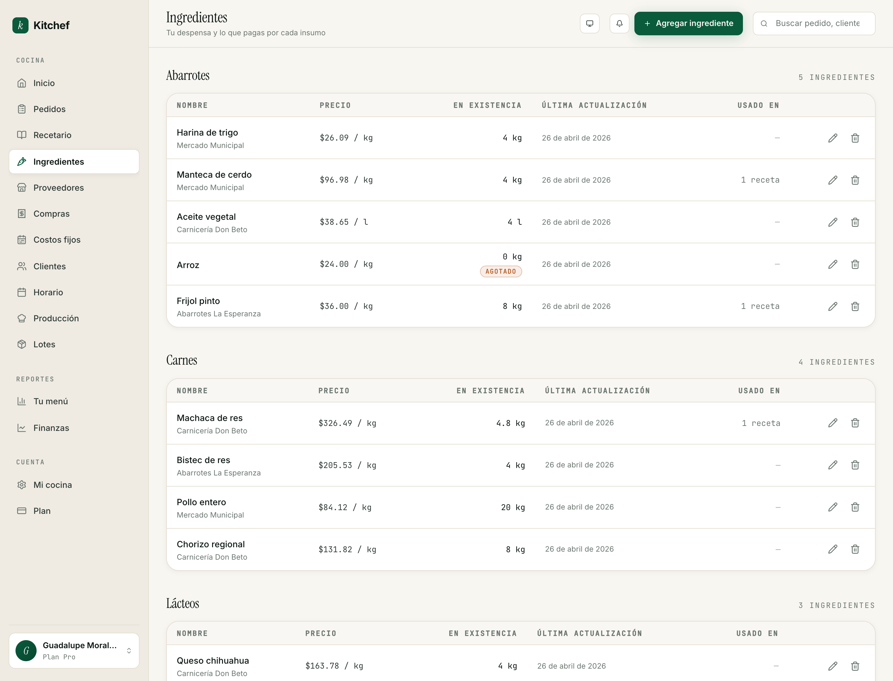
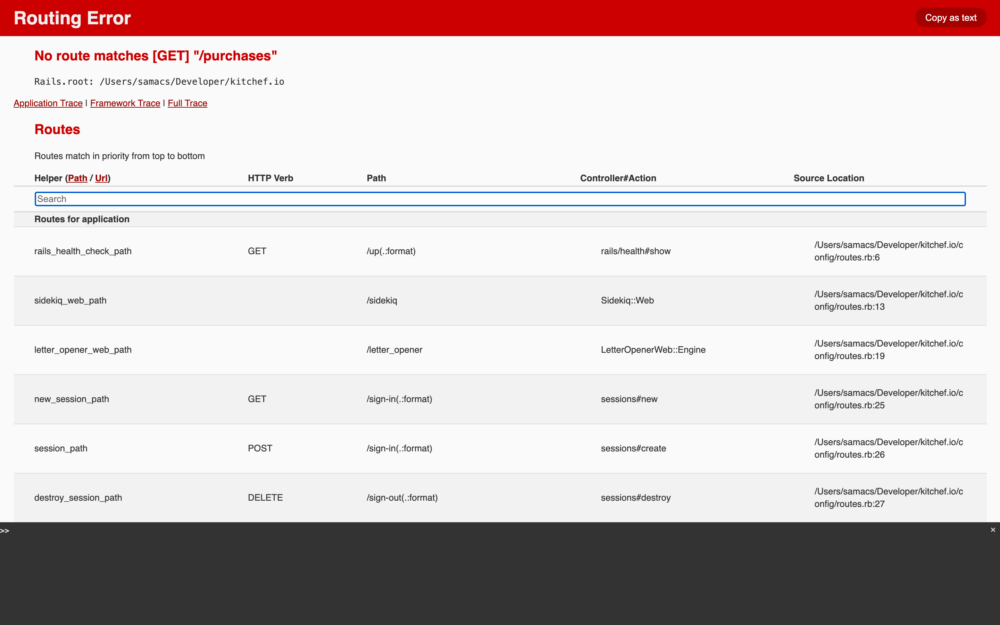

# 5 · Ingredientes y costos

[← Volver al índice](README.md) · Anterior: [Recetas avanzadas](04-recetas-avanzadas.md) · Siguiente: [Horario →](06-horario.md)

---

## Para qué sirve

Este capítulo cubre cuatro pantallas que trabajan juntas para
darte el **número real**: cuánto te cuesta cocinar y cuánto
ganas.

| Pantalla | Para qué |
|---|---|
| **Ingredientes** (`/ingredients`) | La lista de todo lo que compras: harina, leche, machaca, tortillas. Con su precio. |
| **Proveedores** (`/suppliers`) | Quién te lo vende. Mercado, carnicería, tienda de abarrotes. |
| **Compras** (`/purchases`) | El ledger de cada compra que has hecho. Con foto de ticket si quieres. |
| **Costos fijos** (`/fixed-costs`) | Renta, gas, plataformas, empaque. Lo que pagas independientemente de cuántos pedidos tengas. |

Las cuatro alimentan los reportes (Tu menú, Finanzas) — capítulo 11.

## Cuándo usarlas

- **Ingredientes y proveedores** — al activar modo avanzado, captura
  todo en una tarde. Después actualizas precios cuando cambian
  (cada 1-2 meses).
- **Compras** — cada vez que vas al mercado o te entregan algo.
  Captura el mismo día.
- **Costos fijos** — al inicio de cada mes. Captura las recurrentes
  una vez (renta, plataformas) y se repiten solas.

## Ingredientes



Cada ingrediente tiene:
- **Nombre** — *Harina de trigo*, *Machaca de res*.
- **Categoría** — cada cocina tiene las suyas. Al crear tu
  cuenta vienen unas iniciales (*Abarrotes*, *Carnes*, *Lácteos*,
  *Frutas y verduras*, *Especias*, *Otros*), pero puedes crear las
  que necesites.
- **Unidad de compra** — kg, g, l, ml, piece. Es la unidad en la
  que llevas el inventario y en la que ves el precio.
- **Precio por unidad** — cuánto te cuesta una unidad. *$26 / kg*.
- **Proveedor por defecto** — si lo compras casi siempre con la
  misma persona. Aparece debajo del nombre en la lista.
- **En existencia** — cuánto te queda (sólo con inventario activo,
  capítulo 10).
- **Última actualización** — cuándo cambiaste el precio.
- **Usado en** — en cuántas recetas se referencia.

### Agregar un ingrediente

1. Botón **Agregar ingrediente**.
2. **Nombre** específico — *"Tomate bola"* en lugar de *"tomate"*
   (importa cuando captures dos variedades).
3. **Categoría** — escoge una o crea una nueva.
4. **Unidad de compra** — la unidad **canónica** en la que llevas
   tu inventario. Si compras harina por kilo, escoge `kg` aunque
   tus recetas digan "200 g". El conversor entre unidades es
   automático.
5. **Precio por unidad** — en pesos.
6. **Proveedor (opcional)** — combobox; si escribes uno nuevo,
   te lo crea al instante.
7. **Notas (opcional)** — *"sólo lo abren los lunes"*, *"pedir con
   un día de anticipación"*.

Guarda. Listo.

### Cambiar el precio

Edita el ingrediente, cambia el precio, guarda. Si el ingrediente
está usado en recetas descompuestas (modo avanzado), Kitchef te
muestra un **panel de impacto**:

> *Subiste el precio de Harina de trigo de $24 a $28. Esto cambió
> en tus recetas:*
> - *Tortillas — costo subió 8%, margen 70→65%*
> - *Pan dulce — costo subió 5%, margen 60→57%*
>
> *[Mantener margen objetivo en todas]*

El botón **Mantener margen objetivo** ajusta los precios de venta
de las recetas afectadas en una sola operación. Útil cuando hay
inflación o subida puntual.

### Borrar un ingrediente

Si está usado en recetas, Kitchef no te deja borrarlo
directamente — te avisa cuáles. Quítalo primero de las recetas
(o archívalas) y luego bórralo.

## Proveedores


Cada proveedor tiene:
- **Nombre** — *Mercado Municipal*, *Carnicería Don Beto*,
  *Abarrotes La Esperanza*.
- **Contacto** (teléfono, WhatsApp).
- **Dirección** (opcional, con mapa si la geolocalizas).
- **RFC** (opcional, útil si te facturan).

### Agregar un proveedor

Tres formas:

1. **Inline desde un ingrediente** — el combobox del campo
   "Proveedor" en el form de ingrediente acepta un nombre nuevo;
   te lo crea automáticamente.
2. **Inline desde una compra** — el combobox del form de compra
   también te deja crear sobre la marcha.
3. **Desde `/suppliers`** — formulario completo para capturar
   todos los datos (RFC, dirección, etc.).

### Precio por proveedor

Si compras el **mismo ingrediente** a dos proveedores diferentes
(por ejemplo, harina del mercado y harina de Costco), Kitchef
guarda el **historial de precio por proveedor** — para que sepas
cuál te conviene.

Lo capturas a través del flujo de **Compras** (siguiente sección).
Una vez que tienes una compra a Costco con harina, si después
abres el ingrediente Harina, en el panel "Proveedores y precios"
ves los dos: Mercado a $26/kg, Costco a $24/kg. Aparece marcado
cuál es el "default" para los cálculos.

## Compras



El **ledger** de cada compra que has hecho. Cada compra tiene:

- **Fecha de compra**.
- **Proveedor** (opcional — puedes registrar "compras sueltas"
  sin proveedor para llevar gastos).
- **Items** — cada renglón es un ingrediente con cantidad,
  unidad, precio.
- **Total** — calculado solo, o puedes sobreescribirlo (útil cuando
  el ticket te muestra impuestos o redondeos).
- **Foto del ticket** (opcional).
- **Notas** (opcional).

### Capturar una compra

La forma rápida:

1. Botón **Agregar compra** (en `/purchases` o desde la lista de
   compras del mercado).
2. **Fecha** — por defecto hoy.
3. **Proveedor** — combobox; deja vacío si fue compra suelta.
4. Empieza a agregar items: cada uno es un ingrediente + cantidad
   + unidad + precio por unidad. La unidad se autocompleta con la
   canónica del ingrediente.
5. (Opcional) Sube foto del ticket.
6. **Guardar**.

Al guardar, **dos cosas pasan automáticamente**:

- El historial de **precio por proveedor** del ingrediente se
  actualiza.
- Si tienes **inventario activo** (capítulo 10), la cantidad se
  suma al stock del ingrediente.

> **Tip:** Captura compras como hábito al regresar del mercado.
> Tu lista de compras semanal (capítulo 9) te dice qué te falta;
> cuando llegas, marcas comprado y la captura se hace ahí mismo
> con un cajón corto.

### Compras "sueltas" (sin proveedor)

Si fuiste a Soriana por algo que normalmente no compras ahí, no
hace falta crear un proveedor nuevo. Captura la compra **sin
proveedor**: te cuenta para el total de gastos pero no toca el
historial de precios por proveedor de los ingredientes.

## Costos fijos


Renta, gas, internet, plataformas (Mercado Pago, Stripe), empaque
estándar — lo que pagas **independientemente de cuántos pedidos**
tengas.

Cinco categorías por defecto:

- **Renta**
- **Gas y servicios**
- **Empaque**
- **Plataformas**
- **Otros**

Puedes crear más con el combobox.

### Capturar un costo fijo

1. Botón **Agregar costo fijo**.
2. **Categoría** — combobox.
3. **Concepto** — *"Renta de cocina"*, *"Gas natural"*, *"Comisión
   Mercado Pago"*, *"Caja kraft #4"*.
4. **Monto** mensual.
5. **Notas** (opcional).
6. **Guardar**.

Los costos fijos aparecen prorrateados en el reporte de
**Finanzas** (capítulo 11) para calcular tu **utilidad neta**.

### Concepto: empaque

Si tu empaque es uniforme (siempre la misma bolsa, siempre la
misma servilleta), puedes capturarlo aquí como costo fijo
mensual. Si es variable por platillo (caja distinta para pastel
vs taper para guisado), captura el costo de empaque **por receta**
(modo avanzado, capítulo 4) y por **pedido** (configuración del
storefront, capítulo 2).

## La cadena completa

```
Compras  →  Ingredientes  →  Recetas (avanzadas)  →  Costo del platillo
                                       ↓
                                    Margen
                                       ↓
                                  Tu menú (reporte)
                                       ↓
                              ¿Qué me deja más?

Costos fijos  →  Finanzas (reporte)  →  Utilidad neta
```

Cada eslabón depende del anterior. Si tu reporte de Finanzas se
ve raro, lo más probable es que falte capturar algo arriba.

## Errores comunes

| Pasó esto | Hacer esto |
|---|---|
| Mi platillo dice $0 de costo. | La receta probablemente no está descompuesta, o todos sus ingredientes tienen precio $0. Revísalos uno por uno. |
| Subí el precio de un ingrediente y los reportes no cambiaron. | El recálculo es asincrónico — espera unos segundos y recarga. |
| Tengo el mismo ingrediente capturado dos veces ("tomate" y "tomate bola"). | Edita las recetas para que apunten al "correcto", luego archiva el duplicado. |
| Mi total de la compra no cuadra con el ticket por unos pesos. | Usa el campo **Total override** del form para fijar el total exacto del ticket — los items siguen siendo informativos. |
| Mis costos fijos no aparecen en Finanzas. | Asegúrate que la fecha de captura esté dentro del periodo del reporte. |

## Lo que NO necesitas tocar

- **RFC del proveedor** — sólo si te facturan, y aún así está
  para tu propio control. Kitchef no genera CFDIs (todavía).
- **Total override en compras** — déjalo en blanco si los items
  ya te dan el total correcto. Sólo úsalo cuando hay diferencia.
- **Precios "default" por proveedor** — Kitchef los maneja solo
  según tus compras. Si quieres forzar uno, edítalo en el panel
  "Proveedores y precios" del ingrediente.

## Próximos pasos

- **[Capítulo 9 — Producción del día](09-produccion.md)** para ver
  cómo se vuelve útil tu lista de compras semanal.
- **[Capítulo 10 — Inventario y lotes](10-inventario-y-lotes.md)**
  para que las compras suban inventario y los lotes lo bajen.
- **[Capítulo 11 — Reportes](11-reportes.md)** para entender
  Finanzas (utilidad neta) y Tu menú (matriz de margen).

---

[← Volver al índice](README.md) · Anterior: [Recetas avanzadas](04-recetas-avanzadas.md) · Siguiente: [Horario →](06-horario.md)
