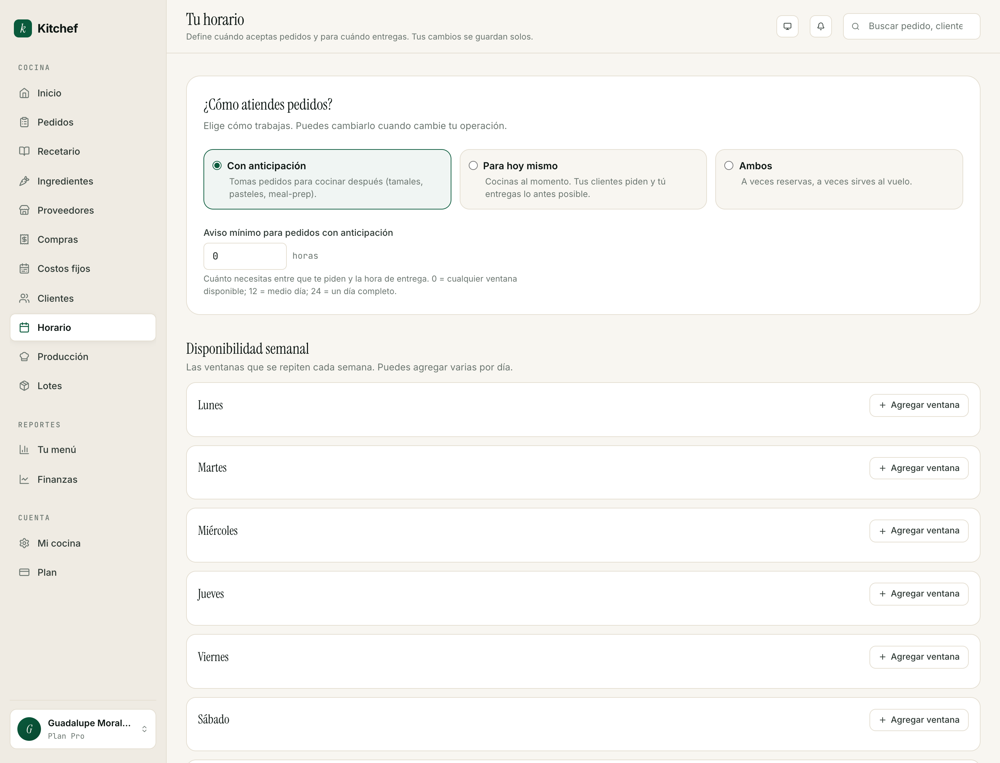

# 6 · Horario

[← Volver al índice](README.md) · Anterior: [Ingredientes y costos](05-ingredientes-y-costos.md) · Siguiente: [Pedidos →](07-pedidos.md)

---

## Para qué sirve

Tu horario define **dos cosas separadas**:

1. **Cuándo recibes pedidos** — los días y horas en los que tu
   storefront acepta órdenes. Fuera de eso, el cliente ve "Por
   encargo" o "Cerrado".
2. **Para cuándo entregas** — las ventanas de entrega/recolección
   que ofreces, y con cuánta anticipación tu cliente debe pedir.

Es la pantalla que te impide vender pedidos que no puedes cumplir.

## Cuándo usarla

- **Al empezar** — los primeros 30 minutos, junto con tu menú.
- **Cuando cambia tu agenda** — vas de vacaciones, abriste un día
  más, dejaste de entregar los domingos.
- **Para excepciones puntuales** — por ejemplo, no recibes pedidos
  el 16 de septiembre porque fiestas patrias.

## La pantalla "Horario"

Vive en `/schedule`. Tres bloques:

### 1. Modo de pedidos
Decides cómo manejas el lead time:

- **Por adelantado** (default) — tus clientes piden con
  anticipación. Tú defines cuántas horas / días.
- **Lo antes posible (ASAP)** — para cocinas que entregan en el
  momento (food trucks, comida rápida). El cliente no escoge hora;
  tú entregas en cuanto esté listo.

Para 95% de los casos, **Por adelantado** es lo correcto. ASAP es
para cocinas que operan con buffer disponible y dispatch propio.

### 2. Tiempo mínimo de anticipación
Cuántos minutos / horas antes el cliente debe pedir. Por ejemplo:

- **0 min** — pedidos para hoy mismo permitidos hasta el límite de
  tu última ventana del día.
- **120 min** — el cliente puede pedir para hoy si faltan más de 2
  horas para la ventana.
- **24 horas** — sólo pedidos para mañana o después.
- **48 horas** — sólo pedidos con dos días de anticipación.

Usa esto para no aceptar pedidos imposibles. Si tus tamales toman 4
horas en cocinarse, pon 4 horas de anticipación.

### 3. Cuadrícula semanal
Siete columnas (Lun → Dom). En cada día, capturas las **ventanas de
entrega**:

- **+ Agregar ventana** en el día — un par hora-inicio / hora-fin.
- Cada ventana puede ser de entrega, de recolección, o ambas
  (toggle).
- Puedes tener varias ventanas en un día. Por ejemplo:
  - Sábado 10:00–12:00 (recolección en cocina)
  - Sábado 12:00–14:00 (entrega a domicilio)
  - Sábado 18:00–20:00 (entrega a domicilio)
- Para **cerrar** un día completo, no agregues ventanas.

> **Tip:** Si tus tres ventanas tienen el mismo horario (10–12,
> 12–14, 14–16), puedes copiar y pegar entre días. Cliquea la
> ventana → menú contextual → **Copiar a otros días**.

## Excepciones por fecha

Para días que rompen el patrón semanal:

- **16 de septiembre** — quieres cerrar aunque sea sábado.
- **24 de diciembre** — abres con un horario especial.
- **Día de tu cumpleaños** — cerrado.

En la sección **Excepciones por fecha**:

1. **+ Agregar excepción**.
2. **Fecha** — la fecha exacta.
3. **Disponibilidad**:
   - **Cerrado** — ese día no hay ventanas, no aceptas pedidos.
   - **Disponible con horario distinto** — defines ventanas
     específicas que sustituyen las semanales.
4. **Nota** (opcional) — *"Día festivo"*, *"Capacitación"*. Aparece
   en el storefront para tu cliente.

Las excepciones tienen prioridad sobre la cuadrícula semanal. Si
tu sábado normal es 10–14 pero pones excepción "16 septiembre:
cerrado", ese día estás cerrada aunque sea sábado.

## Cómo se ve para el cliente

En el storefront, cuando el cliente intenta capturar fecha de
entrega:

- Sólo ve **fechas válidas** — los días donde tienes ventanas y
  donde el lead time está cubierto.
- Sólo ve **horas válidas** — las ventanas que configuraste.
- Si una fecha tiene una excepción, la ve marcada con la nota.
- Si tu cocina está completamente cerrada (sin ventanas en ningún
  día), tu storefront muestra "Por encargo — contactar por
  WhatsApp".

> **Importante:** El horario controla **cuándo** te puede pedir,
> no **qué** te puede pedir. La disponibilidad por platillo (lead
> time individual, agotado, etc.) se maneja en la receta y/o en
> el inventario.

## Patrones típicos

### Cocina casera con entregas dos días a la semana
- **Modo**: Por adelantado.
- **Lead time**: 24 horas.
- **Ventanas**: jueves 10–14, sábado 10–14.
- Resultado: el cliente ordena el miércoles para jueves o viernes
  para sábado.

### Pastelería por encargo
- **Modo**: Por adelantado.
- **Lead time**: 48 horas (los pasteles tardan dos días).
- **Ventanas**: viernes 14–18, sábado 11–14.

### Cocina diaria con almuerzos
- **Modo**: Por adelantado.
- **Lead time**: 90 min.
- **Ventanas**: lunes a viernes 12–14:30.

### Food truck móvil
- **Modo**: ASAP.
- **Lead time**: irrelevante.
- **Ventanas**: jueves a sábado 19:00–23:00.

## Cuando estás de vacaciones

Dos opciones:

1. **Excepción por fecha** — si son días puntuales (3-7 días).
   Capturas cada día como excepción "Cerrado".
2. **Quitar todas las ventanas** — si te vas un mes. Tu storefront
   pasa a modo "Por encargo" y el cliente debe contactarte por
   WhatsApp.

Cuando regresas, restauras las ventanas (o quitas las excepciones).

## Errores comunes

| Pasó esto | Hacer esto |
|---|---|
| Un cliente intentó pedir para hoy y no le aparecen horas. | Tu lead time es mayor a las horas que faltan en el día. Bájalo o acepta sólo para mañana. |
| Captura un domingo aunque cerré los domingos. | Revisa: ¿hay ventana en el domingo? Si sí, quítala. |
| Mi storefront dice "Cerrado" pero estoy abierta. | Revisa que tu día tenga ventanas y que no haya una excepción para hoy. |
| Quiero permitir órdenes hasta las 11pm para entrega de mañana. | Aumenta tu **última hora de captura** vs las ventanas — el captador respeta tu lead time, no la hora del día actual. |

## Lo que NO necesitas tocar

- **Excepciones por fecha** si tu agenda es estable. Captúralas
  cuando se acerquen las fiestas o tu temporada baja.
- **Modo ASAP** salvo que entregues sobre la marcha. La mayoría
  de cocinas funcionan mejor con anticipación.

## Próximos pasos

- **[Capítulo 7 — Pedidos](07-pedidos.md)** para ver cómo llegan
  los pedidos que tu horario permite.
- **[Capítulo 8 — Tu tienda en vivo](08-tienda.md)** para entender
  cómo el cliente experimenta tu horario.

---

[← Volver al índice](README.md) · Anterior: [Ingredientes y costos](05-ingredientes-y-costos.md) · Siguiente: [Pedidos →](07-pedidos.md)
