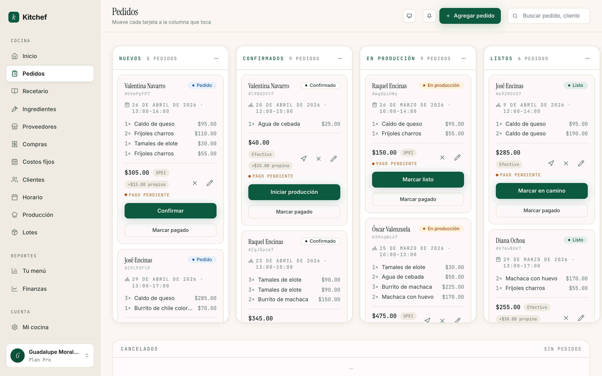

# 7 · Pedidos

[← Volver al índice](README.md) · Anterior: [Horario](06-horario.md) · Siguiente: [Tu tienda en vivo →](08-tienda.md)

---

## Para qué sirve

Pedidos es el corazón de Kitchef. Aquí vives el día. Cada pedido es
una tarjeta que se mueve por columnas según en qué estado está. Lo
abres en la mañana, lo dejas abierto en una pestaña, y lo vas
ordeñando conforme avanza la jornada.

Hay dos formas de que un pedido entre:

- **Por tu tienda pública** — un cliente entra a `kitchef.mx/tu-cocina`,
  agrega platillos al carrito, escoge fecha y hora, y paga (o promete
  pagar). El pedido aparece en tu kanban como **Nuevo** sin que tú
  hagas nada.
- **A mano** — capturas tú misma uno que te llegó por WhatsApp, por
  Instagram, por mensaje, o porque la vecina pasó a pedirte algo. Es
  el botón **+ Agregar pedido** en la esquina.

## Cuándo usarla

Todo el día. Es la pantalla que más tiempo va a estar abierta.

- **Por la mañana** — confirmas los pedidos nuevos que llegaron en la
  noche.
- **Mientras cocinas** — mueves el pedido a *En producción*.
- **Cuando termines de cocinar** — *Listo*.
- **Cuando salgas a entregar** — *En camino* (o el cliente pasa por
  él, si es para recolección).
- **Cuando lo entregaste** — *Entregado* y, si te pagaron al recibir,
  marcas pagado.

## El tablero (kanban)

Cinco columnas, una por cada estado del ciclo:

| Columna | Qué significa | Acción siguiente |
|---|---|---|
| **Nuevos** | Acaba de llegar el pedido. Aún no lo confirmas. | **Confirmar** |
| **Confirmados** | Ya dijiste que sí. El cliente recibió correo. | **Iniciar producción** |
| **En producción** | Estás cocinando. | **Marcar listo** |
| **Listos** | Está empacado y esperando salir. | **Marcar en camino** (entrega) o **Marcar entregado** (recolección) |
| **En reparto** | Vas en camino. | **Marcar entregado** |
| **Entregados** | Llegó al cliente. | (opcional) **Marcar pagado** |

Hay también una columna **Cancelados** abajo del tablero, plegada por
defecto. Es donde van los pedidos cancelados con su razón.

> **Tip:** Cada pedido tiene un identificador corto del estilo
> `#7oG0cd47`. Esa es la matrícula del pedido — sale en los correos,
> en los recibos, y te sirve para buscarlo después en el historial.

## Una tarjeta por dentro

Cada tarjeta tiene cuatro bloques:

1. **Cabecera** — nombre del cliente, identificador del pedido, fecha
   y ventana de entrega.
2. **Items** — qué pidió y cuánto. Si el platillo lleva opciones (sin
   cebolla, salsa picante, etc.), aparecen como chips chiquitos.
3. **Total y método de pago** — el subtotal, el empaque, la propina,
   y cómo va a pagar (Efectivo / SPEI / Tarjeta).
4. **Acciones** — el botón principal (que cambia según el estado) y
   un botón secundario para marcar pagado.

Hay también unos íconos pequeños a la derecha de cada tarjeta:
- ✈ — duplicar el pedido (útil cuando un cliente pide lo mismo otra vez).
- ✕ — cancelar.
- ✎ — editar (cambiar items, fecha, dirección).

## Capturar un pedido a mano

Cuando recibes un pedido por WhatsApp y necesitas anotarlo:

1. Botón **+ Agregar pedido** arriba a la derecha.
2. Elige el cliente. Si es nuevo, presiona **+ Agregar cliente** y
   captura nombre + teléfono.
3. Agrega los platillos. Por cada uno, ajusta la cantidad y, si
   aplica, las opciones (sin chile, doble queso).
4. Pon la **fecha de entrega** y la ventana (10:00–12:00, por
   ejemplo).
5. Marca **entrega a domicilio** o **recolección**.
6. Si es a domicilio, pon la **dirección y colonia** del cliente.
7. (Opcional) Si te dio anticipo, márcalo en la sección **Pago**.
8. **Guardar**.

El pedido aparece en la columna **Nuevos** (state `placed`) listo
para que lo confirmes.

## El ciclo del pedido — paso a paso

### Paso 1 — Confirmar

Cuando le das **Confirmar**, dos cosas pasan:

1. El pedido pasa a la columna **Confirmados**.
2. Si el cliente dejó correo (todos los de tienda pública lo dejan),
   le llega un mail con: el detalle, el total, los datos de tu CLABE
   si aceptas SPEI, y un link para confirmar identidad.

> **¿Por qué importa la confirmación?** Hasta que confirmas, el
> cliente está en zona gris — pidió pero no sabe si lo vas a hacer.
> Confirmar le da certeza. La meta es responder en menos de 30
> minutos durante tus horas activas.

### Paso 2 — Iniciar producción

Cuando empiezas a cocinar, presiona **Iniciar producción**. La
tarjeta se mueve a **En producción**. Esto te sirve a ti (y a quien
te ayude) para saber qué está prendido en la estufa ahora mismo.

> **Tip de bulk:** Si tienes varios pedidos confirmados para el
> mismo día y vas a cocinarlos juntos, ve a [Producción del día](09-produccion.md)
> y usa el botón **Iniciar producción de todas** — mueve todos los
> confirmados de ese día en un click.

### Paso 3 — Marcar listo

Cuando el pedido está empacado y listo para salir (o para que el
cliente pase), presiona **Marcar listo**. La tarjeta se mueve a
**Listos**.

Si el pedido es **para recolección** (`pickup`), se queda ahí hasta
que el cliente pase. Le mandamos automáticamente un recordatorio por
correo después de un rato si no ha pasado.

Si el pedido es **a domicilio** (`delivery`), aparece el botón
**Marcar en camino** para cuando salgas con él.

### Paso 4 — En camino / Entregado

- **Marcar en camino** — para pedidos a domicilio. Te abre el mapa
  en tu celular si tocas el ícono de mapa en la tarjeta. El pedido
  pasa a **En reparto**.
- **Marcar entregado** — final del flujo. Se mueve a **Entregados**.

### Paso 5 — Marcar pagado

El pago es **independiente del estado del pedido**. Puedes:

- Cobrar al confirmar (anticipo) — captúralo en la sección **Pago**
  del formulario.
- Cobrar contra entrega (efectivo o transferencia) — al recibir el
  pago, presiona **Marcar pagado** en la tarjeta. Se queda con un ✓
  verde.
- Cobrar después (cliente recurrente, te paga el viernes por todo lo
  de la semana) — déjalo sin marcar; desde **Reportes** ves cuánto
  te deben.

Si te equivocaste, **Desmarcar pagado** revierte la marca.

## Cancelar un pedido

A veces toca. La cocinera se enfermó, no llegó el ingrediente, el
cliente pidió cancelar.

1. En la tarjeta, presiona **✕** (cancelar).
2. Elige una razón:
   - **El cliente canceló**
   - **No confirmó**
   - **Sin stock** (te quedaste sin algo)
   - **Problema de entrega**
   - **Otra** (necesitas escribir nota)
3. Confirma.

El pedido se mueve a la columna **Cancelados** (abajo). Queda en tu
historial — no se borra. Si activas inventario, los lotes que ese
pedido había consumido se liberan automáticamente.

> **Tip:** Si cancelaste por error, el pedido se puede **duplicar**
> (ícono ✈) para recapturarlo como nuevo. Los items y el cliente se
> copian; tú ajustas la fecha.

## Chips útiles que vas a ver

Las tarjetas tienen chips de colores con información rápida:

- **● Pedido** (azul) — recién llegado, falta confirmar.
- **● Confirmado** (azul) — lo confirmaste tú o el cliente.
- **● En producción** (verde) — estás cocinando.
- **● Listo** (verde) — empacado.
- **+$X.XX propina** (gris) — el cliente agregó propina.
- **+$X.XX empaque** (gris) — empaque cobrado.
- **SPEI / Efectivo / Tarjeta** (gris) — método de pago elegido.
- **● Pago pendiente** (rojo claro) — falta cobrar.
- **✓** (verde) — pagado.
- **⚠ sin stock** (ámbar) — el platillo no tenía lote disponible.
  Sólo aparece si activaste inventario (capítulo 10).

## El pago en efectivo y el cambio

Si tu cliente paga en efectivo y te dice "te llevo $500 en billete",
lo capturas así:

1. En el formulario del pedido (al editar o al capturar), baja a
   **Pago**.
2. Marca **Efectivo**.
3. En **Monto que va a pagar**, escribe `500`.
4. El sistema te dice cuánto cambio darle.

Esto se ve también en la tarjeta del kanban — un chip de "+$X.XX en
efectivo" — para que tengas el cambio listo antes de salir.

## Lo que NO necesitas tocar

- **Bulk transitions** (mover muchos a la vez) — sólo si tienes >5
  pedidos en la misma columna. La barra de acciones aparece sola
  cuando seleccionas pedidos.
- **Editar la dirección post-entregado** — los pedidos entregados
  son inmutables a propósito (es tu auditoría). Si necesitas cambiar
  algo después de entregar, duplica + edita.

## Errores comunes y cómo recuperarte

| Pasó esto | Hacer esto |
|---|---|
| Marqué un pedido como entregado por error. | El estado entregado es final. Duplica el pedido para volver a empezar el ciclo. |
| Marqué pagado y no era. | **Desmarcar pagado** en la misma tarjeta. |
| Cancelé por equivocación. | **Duplicar** el pedido cancelado para recrearlo. |
| El cliente cambió la dirección. | Edita el pedido (✎) antes de marcarlo *en camino*. |
| Llegó un pedido a un platillo agotado. | Si tienes inventario activo, el sistema marca **⚠ sin stock**. Anota un lote nuevo (capítulo 10) o cancela con razón "sin stock". |

## Próximos pasos

- **[Capítulo 8 — Tu tienda en vivo](08-tienda.md)** explica cómo se
  ve el flujo *desde el cliente*. Útil para entender por qué las
  tarjetas llegan como llegan.
- **[Capítulo 9 — Producción del día](09-produccion.md)** es la
  vista hermana de Pedidos: en lugar de columnas por estado, te
  ordena por hora de entrega y te dice qué cocinar.

---

[← Volver al índice](README.md) · Anterior: [Horario](06-horario.md) · Siguiente: [Tu tienda en vivo →](08-tienda.md)
