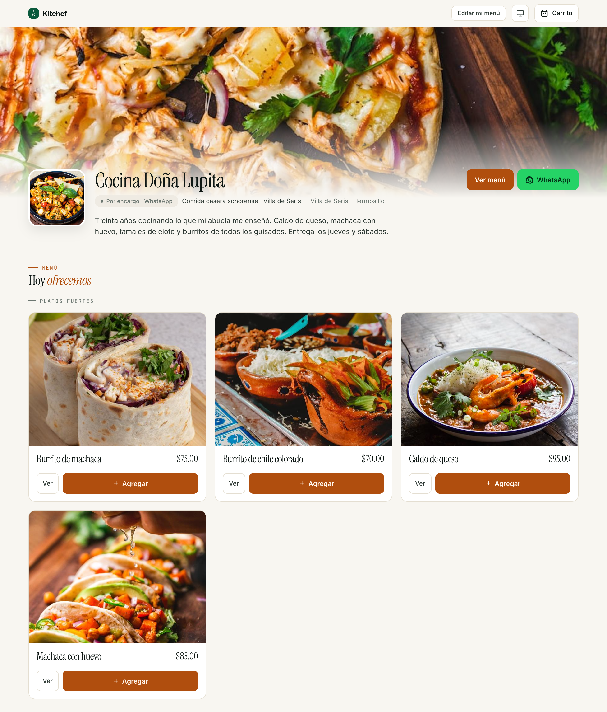
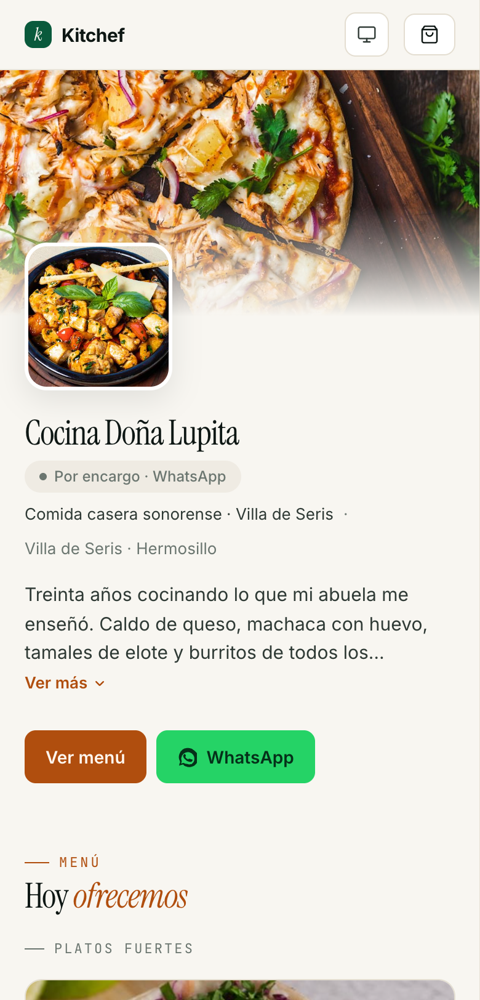

# 8 · Tu tienda en vivo

[← Volver al índice](README.md) · Anterior: [Pedidos](07-pedidos.md) · Siguiente: [Producción del día →](09-produccion.md)

---

## Para qué sirve

Este capítulo no es sobre una pantalla del panel, sino sobre la
**otra mitad** de Kitchef: lo que tu cliente ve. Entender el
storefront te ayuda a:

- Saber por qué los pedidos llegan como llegan.
- Anticipar dudas de tus clientes.
- Cuidar lo que se ve "del otro lado del mostrador".

Tu storefront vive en `kitchef.mx/<tu-slug>`. Es público, no
necesita login, se ve en celular y computadora, y carga rápido.

## Cuándo revisarlo

- **Después de cualquier cambio** en tu cocina pública o tu menú —
  abre tu URL en una pestaña incógnita y verifica.
- **Antes de compartir tu link** por WhatsApp, Instagram, etc.
- **Una vez al mes** — para ver con ojos frescos cómo te ven tus
  clientes.

## La home de tu cocina

Lo primero que ve quien entra a `kitchef.mx/tu-cocina`:

1. **Hero**: tu portada, encima tu logo, nombre, frase corta. Si
   ofreces recolección, los chips *"Por encargo"* y *"WhatsApp"*.
2. **Sobre la cocina**: tu descripción larga, colonia/ciudad, zonas
   de entrega.
3. **Aviso de horario**: si está abierta para pedidos hoy, *"Aceptando
   pedidos"*. Si no, *"Por encargo · próxima ventana: sábado 10:00"*.
4. **Botón "Ver menú"** — al menú completo de platillos.
5. **Botón "WhatsApp"** — abre tu chat directo si capturaste WhatsApp.
6. **Mapa** (si activaste pickup) — tu dirección de recolección con
   alfiler.

> **Diferencia importante con apps de delivery:** Aquí no hay
> categorías de "comida saludable / pizza / hamburguesas". El
> cliente ya sabe a qué cocina entró — es la tuya.

## El menú

Cuando el cliente toca **Ver menú**, ve tus platillos publicados
agrupados por categoría:

- Cada platillo es una tarjeta con foto grande, nombre, precio,
  descripción, y dos botones: **Ver** (detalle) y **Agregar**.
- Si tu platillo necesita anticipación, aparece un chip
  *"Pedir con 4 horas"*.
- Si tienes inventario activo (capítulo 10):
  - Stock alto → silencio.
  - 1-5 unidades → *"Quedan 3"*.
  - 1 unidad → *"Última pieza"*.
  - 0 + política warn → *"Por encargo"*.
  - 0 + política block → *"Agotado"* + botón Agregar deshabilitado.

> **Importante:** Las categorías y el orden vienen de cómo
> organizaste tus recetas en el panel. Si quieres mover un
> platillo arriba, cámbialo de categoría o muévelo dentro de la
> categoría desde `/recipes`.

## Detalle de platillo

Cuando el cliente toca **Ver** en una tarjeta, va a
`kitchef.mx/tu-cocina/dishes/burrito-de-machaca`:

- Foto grande, nombre, precio.
- Descripción completa.
- Si tiene **opciones removibles** (componentes con toggle), un
  bloque *"Personaliza"* con chips para quitar (*"sin chile"*).
- Si tiene **grupos de opciones**, la interfaz se adapta al tipo:
  radios para opciones únicas, checkboxes para varias, swatches
  para variantes con color, o un campo de texto libre.
- Botón **Agregar al carrito** — confirma cantidad y cualquier
  customización.

Cada cambio en customización se ve en el precio: si el cliente
agrega "queso extra +$15", el precio mostrado actualiza al
instante.

## El carrito

Es un cajón flotante a la derecha (en escritorio) o de pantalla
completa (en móvil). Muestra:

- Cada item con cantidad, opciones, precio.
- Subtotal.
- Botón **Continuar al pedido**.

El carrito **no se borra** si el cliente sale y vuelve a entrar al
storefront — vive en el `sessionStorage` del navegador. Si cierra
el navegador completo, sí se pierde.

## Captura del pedido (checkout)

Cuando toca **Continuar**, llega a un formulario simple:

1. **Datos del cliente**:
   - Nombre, apellido.
   - Teléfono (validamos formato mexicano).
   - Email (obligatorio — es el gate de identidad).
2. **Tipo de entrega** (sólo aparecen los que activaste en
   **Mi cocina → Métodos de entrega**):
   - **Recolección** — pasa por la cocina.
   - **Entrega a domicilio** — pide dirección + colonia.
   Si no activaste ningún método, el checkout queda bloqueado
   (capítulo 2).
3. **Fecha y hora de entrega** — picker que respeta tu horario y
   lead time. Sólo ve fechas/ventanas válidas.
4. **Notas para la cocinera** — texto libre.
5. **Pago**:
   - Método: efectivo / transferencia / tarjeta (los que
     activaste).
   - Si SPEI: ve tu CLABE y datos.
   - Si efectivo: campo *"¿Con cuánto va a pagar?"* para que
     llegues con el cambio.
   - Si tarjeta: ve tus instrucciones (link de Mercado Pago, etc.).
6. **Propina** (si activaste) — chips con porcentajes sugeridos
   + campo libre.
7. **Empaque** — sumado al subtotal automáticamente si lo
   configuraste.
8. **Cupón / código de descuento** — si tienes promociones activas,
   el cliente puede ingresar un código. El descuento se aplica al
   total y se muestra desglosado.
9. **Botón "Confirmar pedido"**.

Al confirmar:
- El pedido entra a tu kanban en estado **Nuevo** (`placed`).
- El cliente ve una pantalla de "Recibimos tu pedido — revisa tu
  correo".
- Le mandamos un correo con: detalle, total, forma de pago, link
  para revisar/confirmar identidad, y tu WhatsApp.

## La página de pedido del cliente

`kitchef.mx/tu-cocina/orders/ord_xxx?t=<token>`. Cada pedido tiene
una página propia que el cliente puede:

- **Ver** — detalle completo, total, status timeline.
- **Confirmar** (cuando llega del email) — si ya revisó la
  dirección y los items, presiona el botón **Confirmar mi pedido**.
- **Re-leer** — el link sigue válido por 7 días.

La página también se **actualiza en vivo** vía Turbo Streams:
cuando tú mueves el pedido en tu kanban, su pantalla muestra
*"En cocina"* sin que tenga que recargar.

## La experiencia móvil

El 80% de tus clientes va a entrar desde el celular. Cosas que
funcionan distinto:

- El menú es una columna, no una grilla.
- El carrito ocupa pantalla completa cuando se abre.
- Los pickers de fecha/hora se vuelven los nativos del sistema
  (mejor experiencia que el web).
- Los botones **Llamar** y **WhatsApp** abren tu app
  correspondiente sin pasar por una página intermedia.

## Compartir tu link

Tres lugares clave:

1. **Bio de Instagram** — el único campo donde puedes poner un
   link clicable. *"📍 kitchef.mx/cocina-de-elena"*.
2. **WhatsApp** — al cliente que te pregunta "¿qué tienes hoy?",
   contesta con el link.
3. **Stickers / tarjeta** — un QR impreso pegado al refrigerador
   o entregado con el pedido.

Para generar un QR de tu link, usa cualquier generador gratuito
(`qr-code-generator.com` por ejemplo).

## Errores comunes (lado del cliente)

| Pasó esto | Hacer esto |
|---|---|
| Mi cliente no recibe el correo de confirmación. | Pídele revisar spam. Si tu correo de salida (Resend) tiene problemas, contacta soporte. |
| El cliente confirma pero el pedido no avanza. | El cliente confirma su **identidad**, no la confirmación del pedido. La confirmación oficial la haces tú en el kanban. |
| El cliente no puede pedir para "hoy". | Tu lead time o tus ventanas no le permiten. Revisa `/schedule`. |
| El cliente vio "Quedan 3" y al confirmar le dice "agotado". | Otro cliente compró las últimas 3 mientras él decidía. Bajo política warn, su pedido entra como oversold (capítulo 10). |
| El cliente quiere personalizar pero no le aparecen opciones. | La receta no tiene opciones configuradas. Edita la receta para agregar grupos de opciones (capítulo 4). |

## Lo que NO controlas desde el panel

- **El carrito guardado en el navegador del cliente.** Si capturó
  algo y luego lo cancelaste tú, su carrito sigue mostrando lo
  que ya no existe — al confirmar le dirá "ese platillo ya no
  está disponible".
- **El email del cliente.** Ellos lo escriben, ellos lo dueñan.
- **Cuál variante de tarjeta usa Mercado Pago/Stripe.** Tú das
  el link; ellos pagan donde puedan.

## Próximos pasos

- **[Capítulo 7 — Pedidos](07-pedidos.md)** — el otro lado del
  flujo (lo que tú haces cuando llega el pedido).
- **[Capítulo 12 — Clientes](12-clientes.md)** — qué pasa con la
  información del cliente después de que ordena.

---

[← Volver al índice](README.md) · Anterior: [Pedidos](07-pedidos.md) · Siguiente: [Producción del día →](09-produccion.md)
