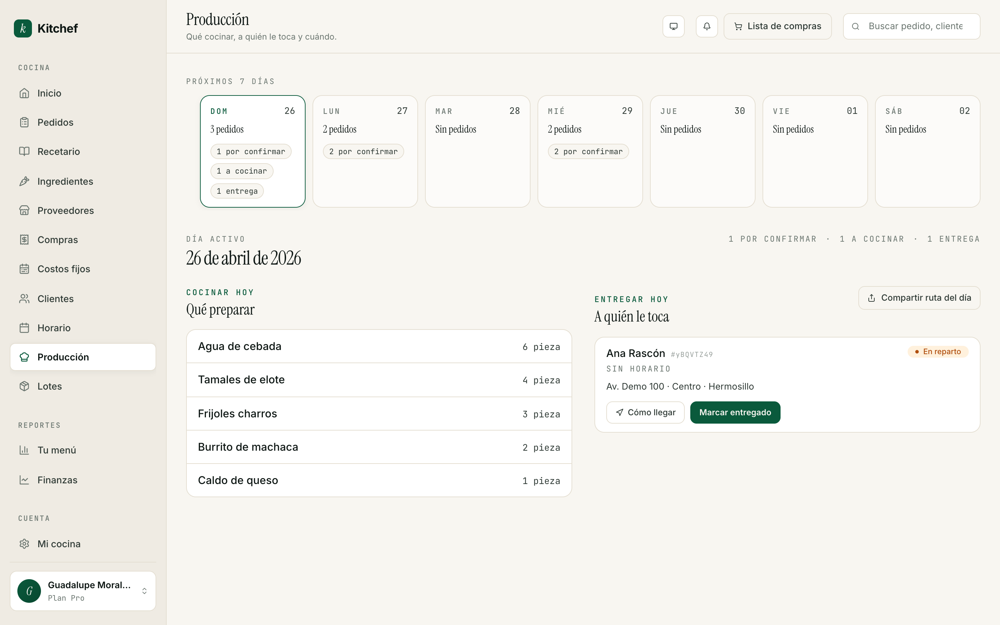
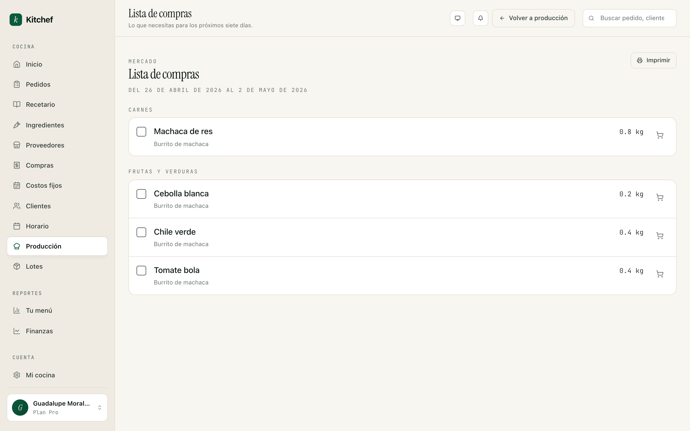

# 9 · Producción del día

[← Volver al índice](README.md) · Anterior: [Tu tienda en vivo](08-tienda.md) · Siguiente: [Inventario y lotes →](10-inventario-y-lotes.md)

---

## Para qué sirve

Pedidos te muestra un kanban — cuál pedido está en qué estado.
Producción te muestra una **agenda del día**: qué hay que cocinar,
para quién, y a qué hora sale.

Es la pantalla de las 7 de la mañana. La que abres con el café para
saber qué prender en la estufa.

## Cuándo usarla

- **Al empezar el día** — qué cocinar, en qué orden, cuántos
  pedidos esperan.
- **El día anterior** — para saber si tienes que comprar algo antes
  de cerrar el mercado.
- **Una vez a la semana** — para imprimir o ver tu **Lista de
  compras** para el mercado.

## La pantalla "Producción"



Tres bloques:

### 1. Resumen del día (arriba)

El día activo, un strip de los próximos 7 días para saltar entre
fechas, y tres números clave del día:

- **N por confirmar** — pedidos nuevos esperando tu OK.
- **N a cocinar** — pedidos confirmados que aún no empiezas.
- **N entregas** — cuántos vas a entregar hoy.

Y un botón **Lista de compras** que te lleva a la vista semanal
(más abajo).

### 2. "Cocinar hoy" (izquierda)

Lista de qué cocinar, agrupada por platillo, con cantidades sumadas
de todos los pedidos del día. Por ejemplo:

```
Tamales verdes       12 unidades  (3 pedidos)
Pastel tres leches    1 unidad   (1 pedido)
Burrito de machaca    8 unidades  (2 pedidos)
```

Si tienes varios pedidos confirmados para hoy y vas a echarlos a la
estufa juntos, presiona **Iniciar producción (N)** y los mueves a
"En producción" en bloque, sin tener que ir uno por uno al kanban.

### 3. "Entregar hoy" (derecha)

Lista de pedidos a entregar hoy ordenada por hora:

```
10:00–12:00   Doña Carmen · Tamales verdes        $650
12:00–14:00   Lupita H.   · Pastel 3 leches       $850
13:00–15:00   Marisol V.  · 15 meal preps       $2,100
```

Para cada uno, ves la dirección y un ícono de mapa. Tocas el ícono y
te abre la dirección en Google Maps en tu celular.

> **Tip:** Hay un botón **Compartir ruta del día** que te genera un
> link con el orden óptimo de entregas. Útil si entregas tú o si
> mandas a un repartidor de confianza.

## Lista de compras semanal



Desde Producción, presiona **Lista de compras** o ve directo a
`/production/shopping-list`. Te muestra **lo que necesitas comprar
para los próximos 7 días**, calculado a partir de los pedidos
confirmados.

Cada renglón es un ingrediente:
- Nombre.
- Cantidad necesaria.
- Última actualización del precio.
- Si ya lo compraste esta semana, un ✓ verde con el monto que
  pagaste.

> **¿Cómo sabe qué comprar?** Si tienes tus recetas **descompuestas
> en ingredientes** (modo avanzado, capítulo 4), Kitchef suma los
> ingredientes de todos los pedidos confirmados. Si no, te muestra
> los nombres de las recetas y tú decides los insumos.

### Marcar como comprada

Cuando vienes del mercado:

1. Encuentra el ingrediente en la lista.
2. Presiona **Marcar como comprada**.
3. Se abre un cajón a la derecha: elige **proveedor** (o déjalo
   vacío), captura cantidad, unidad, y precio por unidad.
4. **Guardar**.

Lo que hace:
- Crea un registro de **compra** en `/purchases` (o lo agrega a la
  compra de hoy si ya tienes una abierta para ese proveedor).
- Si tienes inventario activo (capítulo 10), suma esa cantidad a tu
  stock del ingrediente.
- En la lista, marca el renglón con el ✓ y el monto.

Los items que no marcaste **siguen apareciendo** en la lista —
indican lo que aún te falta. Si bajan los pedidos por una
cancelación o porque ya pasaron, salen de la lista solos.

## Trabajar con dos pestañas

El truco más útil:

1. Una pestaña en `/orders` (Pedidos) — ahí mueves cada pedido
   conforme avanza.
2. Otra pestaña en `/production` — ahí ves la suma del día y la
   ruta de entregas.

Las dos se actualizan solas con Turbo Streams cuando algo cambia
del otro lado. No tienes que recargar.

## Patrón típico de la jornada

| Hora | Pantalla | Qué haces |
|---|---|---|
| 7:00 | Producción | Reviso qué cocinar y cuánto. |
| 7:30 | Pedidos | Confirmo los nuevos que llegaron en la noche. |
| 8:00 | Producción | "Iniciar producción de todas". |
| 11:00 | Pedidos | Marco listos los que ya empaqué. |
| 12:00 | Producción | Veo la ruta del día y salgo. |
| 14:00 | Pedidos | Marco entregados + pagados. |
| 18:00 | Producción → Lista de compras | Para mañana o para el mercado del jueves. |

Eso es Kitchef. Dos pantallas. Un café.

## Errores comunes

| Pasó esto | Hacer esto |
|---|---|
| La lista de compras me muestra "tamales verdes" en lugar de los ingredientes. | Tu receta no está descompuesta. Capítulo 4 explica cómo. |
| Marqué algo como comprado y me equivoqué de cantidad. | Ve a `/purchases`, edita la compra correspondiente. |
| Los pedidos del día no aparecen en "Cocinar hoy". | Sólo aparecen los pedidos en estado **Confirmado** o más avanzado. Confirma primero los Nuevos. |
| Quiero ver la producción de mañana. | Usa el strip de días arriba para saltar adelante. |

## Próximos pasos

- **[Capítulo 5 — Ingredientes y costos](05-ingredientes-y-costos.md)**
  para entender qué proveedores y compras alimentan esta vista.
- **[Capítulo 10 — Inventario y lotes](10-inventario-y-lotes.md)**
  para llevar control automático de cuánto cocinaste vs cuánto te
  queda.

---

[← Volver al índice](README.md) · Anterior: [Tu tienda en vivo](08-tienda.md) · Siguiente: [Inventario y lotes →](10-inventario-y-lotes.md)
