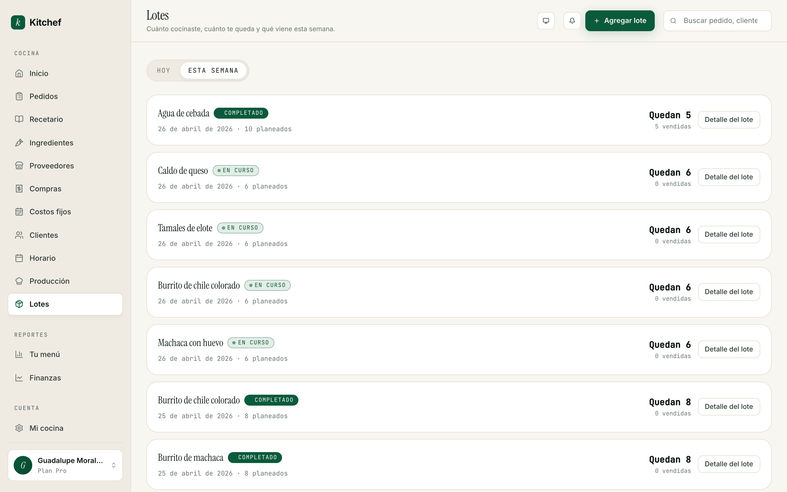
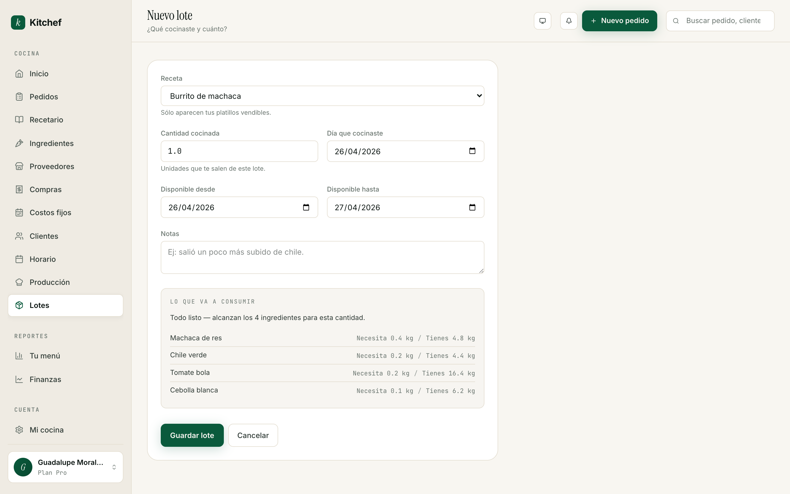

# 10 · Inventario y lotes

[← Volver al índice](README.md) · Anterior: [Producción del día](09-produccion.md) · Siguiente: [Reportes →](11-reportes.md)

---

## Para qué sirve

Hasta este punto, Kitchef confía en lo que tú dices. Si capturaste
12 tamales como pedido, los acepta. No sabe si tienes 12 tamales,
si te quedan 3, o si te acabaste la masa.

Con **Inventario y lotes** activado, el platillo cambia. Anotas:

- **Cuánto cocinaste** — *"hoy hice 24 tamales verdes"*. Es un
  **lote**.
- **Cuánto te queda** del lote, en tiempo real. Cada pedido lo
  baja automáticamente.
- **Qué tienes en la despensa** — cuánta harina, cuánta leche, cuánto
  chile. Cada lote lo deduce; cada compra lo sube.

Tu tienda pública también cambia: el platillo aparece como
*"Quedan 3"*, *"Última pieza"*, o *"Agotado"*, según lo que reste
del lote más nuevo.

## Cuándo activarla

**No el primer mes.** No el primer trimestre, si tu volumen es
pequeño. Inventario sirve cuando:

- Vendes más de 30-40 pedidos por semana.
- Tienes platillos que **se agotan** y te cansas de explicar a tu
  cliente "perdón, ya no me quedan".
- Tienes un menú estable (las mismas 8-12 recetas).
- Compraste un costal de harina y quieres saber cuánto te falta para
  la próxima semana.

Si nada de eso te suena, **déjalo apagado**. Kitchef funciona
perfectamente sin inventario.

## Activarla

1. Ve a **Mi cocina** (`/account/edit`).
2. Baja a la sección **Funciones avanzadas**.
3. Activa el toggle **Inventario y lotes**.
4. Te lleva automáticamente a una pantalla de bienvenida con tres
   pasos: cocinas, vendes, reabasteces.
5. En el menú lateral aparece una nueva sección: **Lotes**.

Si te arrepientes, vuelves a `/account/edit` y desactivas el
toggle. La sección de Lotes desaparece, los avisos de "agotado" se
quitan, y todo vuelve a funcionar como antes. **No se borra nada**
— sólo se oculta.

## Configurar reglas

En la misma sección, una vez activo, ves dos reglas:

### Cuando se acaba un platillo

- **Aceptar pedido y avisarte** (por defecto) — el cliente puede
  ordenar igual; tu kanban marca el pedido con un chip *"⚠ sin
  stock"* y un texto educativo: *"Falta cocinar 5 × Burrito de
  machaca para este pedido. [Anotar un lote]"*.
- **Bloquear el pedido** — el platillo se marca como *Agotado* en
  tu menú y el botón **Agregar** se deshabilita. Tu cliente no puede
  ordenar.

> **Recomendación:** Empieza con **Aceptar y avisarte**. Te da
> margen para cocinar otro lote. Sólo cambia a **Bloquear** si
> quieres ser estricta (ej. cocina pequeña, no quieres prometer y
> fallar).

### Días que vive un lote por defecto

Cuántos días después de cocinar el lote sigue siendo válido. Por
defecto **1** (hoy + mañana). Bájalo a 0 si tu producto es del día
(helado, mariscos), súbelo a 2-3 para repostería que aguanta más.
Lo puedes cambiar lote por lote también.

### Avísame cuando un ingrediente baje a X%

Cuando un ingrediente baje del porcentaje (de tu última compra),
aparece marcado como *"bajo stock"* en la lista de Ingredientes.
Por defecto 20%.

## Tu primera vez con lotes

### Paso 1 — Anota lo que tienes en la despensa

Si ya tienes el modo avanzado activo y has registrado compras, tu
inventario arranca de cero pero las próximas compras se suman. Si
quieres pre-cargar lo que ya tienes:

1. Ve a `/ingredients`, abre cada ingrediente.
2. En la sección **Historial** (sólo aparece con inventario activo),
   captura un movimiento manual con la cantidad que tienes.

Es la única captura tediosa. Después todo se mantiene solo.

### Paso 2 — Anota tu primer lote

Cuando cocines algo:

1. **Lotes** en el menú lateral → **+ Agregar lote**.
2. Elige la receta.
3. **Cantidad cocinada** — cuántas unidades te salieron.
4. **Día que cocinaste** — por defecto hoy.
5. **Disponible desde / hasta** — por defecto hoy + mañana.
6. **Notas** (opcional) — *"salió un poco más subido de chile"*.
7. **Guardar lote**.

Al guardar:
- Te restamos los ingredientes según la receta.
- Si te alcanzaron, ves *"Anotamos tu lote"*.
- Si no te alcanzaron a algunos ingredientes, aparece un aviso
  arriba: *"Te quedaste sin: harina (te faltaron 0.5 kg). Anota una
  compra cuando puedas para no acumular faltantes."*

### Paso 3 — La pantalla de Lotes



Dos pestañas: **Hoy** y **Esta semana**.

Cada lote es una tarjeta con:
- Nombre de la receta.
- Estado (chip de color):
  - **PLANEADO** (gris) — anotado, aún no se inicia.
  - **EN CURSO** (verde, con punto pulsante) — estás cocinando.
  - **COMPLETADO** (verde lleno) — ya cocinaste y se cerró.
  - **CANCELADO** (ámbar, tachado) — lo descartaste.
- Fecha que cocinaste.
- Cuánto cocinaste.
- **Quedan N** — disponibles para vender.
- **N vendidas** — cuántas te ha consumido el flujo de pedidos.

### Paso 4 — Vista previa de impacto



Cuando llenas el formulario de *Nuevo lote*, abajo aparece una
sección **"Lo que va a consumir"** que se actualiza al instante
mientras cambias receta o cantidad:

- Si tienes ingredientes para esa cantidad: *"Todo listo —
  alcanzan los 4 ingredientes para esta cantidad."*
- Si te faltan: *"**Te faltan:** 2.4 kg de Machaca de res, 1.6 kg
  de Cebolla blanca. Puedes anotar el lote igual — el inventario
  va a quedar en negativo."* + botón **Registrar una compra**.

Esto te ayuda a decidir antes de cocinar: ¿voy al mercado primero,
o procedo y compro después?

## Ciclo del lote

```
PLANEADO → EN CURSO → COMPLETADO
                ↓
            CANCELADO
```

- **Anotar** un lote arranca en *EN CURSO* (asume que estás
  cocinando ahora). Los ingredientes ya se descontaron.
- **Marcar como completado** en la pantalla del lote — termina el
  ciclo. Si te quedaron menos unidades de las planeadas, le pones
  el número real y te restauramos la diferencia al inventario.
- **Cancelar lote** — restaura todos los ingredientes al inventario,
  marca el lote como CANCELADO en el historial, y cualquier pedido
  que estaba consumiendo de él se rebincula a otro lote disponible
  (o se marca como *sin stock*).

## Cómo se conectan los pedidos con los lotes

Cuando un cliente ordena 3 burritos de machaca para hoy:

1. Kitchef busca el lote más viejo activo de "Burrito de machaca"
   con fecha de entrega cubierta y al menos 3 unidades remaining.
2. Si lo encuentra: el `OrderItem` se vincula al lote, le restamos 3
   unidades. Tu kanban se ve normal.
3. Si NO lo encuentra:
   - Política **Aceptar y avisarte**: el pedido se acepta, el item
     se marca *oversold*, el kanban muestra el chip *"⚠ sin stock"*
     con un botón **Anotar un lote** que abre el formulario con la
     receta pre-seleccionada.
   - Política **Bloquear**: el pedido se rechaza con error.

## Cuando aparece un *"sin stock"* en el kanban

Tres maneras de resolverlo:

1. **Anotar un lote** — toca el botón *Anotar un lote* directamente
   desde el chip. Cocinas + capturas + el sistema vincula el pedido
   al nuevo lote automáticamente. El chip desaparece.
2. **Cambiar la fecha del pedido** — edita el pedido y mueve la
   fecha de entrega a un día con stock disponible.
3. **Cancelar el pedido** — con razón "sin stock". Mejor avisa al
   cliente por WhatsApp antes.

## El menú público con inventario

Tus clientes ven badges en cada platillo:

- **(silencio, sin badge)** — hay >5 unidades. Vibra de abundancia.
- **"Quedan 3"** — entre 1 y 5. Crea urgencia sin alarma.
- **"Última pieza"** — exactamente 1.
- **"Por encargo"** (política Aceptar) — agotado pero pueden ordenar
  igual; tú decides cuándo cocinar.
- **"Agotado"** (política Bloquear) — agotado y el botón Agregar
  está deshabilitado.

Las tarjetas de platillos agotados también tienen un borde sutil:
rojo claro bajo política Bloquear, ninguno bajo Aceptar (el chip
basta).

## Las recetas en tu panel también cambian

Cuando inventario está activo:

- En `/recipes`, las tarjetas de platillos sin stock tienen un
  borde rojo (Bloquear) o ámbar (Aceptar) y un texto chico
  educativo: *"Sin lotes para hoy — vendiendo sin stock"* o *"Anota
  un lote para volver a vender"*.
- En la página de detalle de cada receta (`/recipes/:slug`), arriba
  ves un panel **Stock disponible** con la cantidad para hoy y un
  botón **Anotar nuevo lote**.

## Lista de Ingredientes con inventario

En `/ingredients` aparece una columna nueva: **En existencia**, con
la cantidad actual y un chip *"bajo stock"* (texto ámbar) o
*"agotado"* (texto rojo) cuando el inventario es bajo.

Al abrir cada ingrediente, hay una pestaña **Historial** con los
últimos 30 movimientos: compras (+), producciones (−), ajustes
manuales, cancelaciones. Sólo lectura — para corregir, agregas un
movimiento nuevo.

## Cómo se reabastece

Hay tres formas de subir tu inventario:

1. **Una compra.** Cualquier compra que registres en `/purchases`
   suma sus cantidades al ingrediente correspondiente. Si compraste
   5 kg de harina, harina sube 5 kg.
2. **Cancelar un lote.** Restaura los ingredientes que ese lote
   consumió.
3. **Ajuste manual.** Pendiente — por ahora se hace por consola.

## Errores comunes

| Pasó esto | Hacer esto |
|---|---|
| Tengo lotes con 5 unidades pero el pedido sigue marcado *sin stock*. | El pedido se anotó **antes** de los lotes. Anota un lote nuevo: el sistema sweep retroactivamente y resuelve el pedido viejo. |
| Cancelé un lote y un pedido se rompió. | El sistema intenta rebindarlo a otro lote disponible. Si no lo logra, lo marca como *sin stock*. Anota un lote nuevo de esa receta. |
| Mi inventario está en negativo. | Significa que cocinaste más de lo que tenías capturado. Registra una compra (aunque sea pasada) o haz un ajuste manual. |
| Los ingredientes que se descuentan no son los correctos. | La receta probablemente no está descompuesta o tiene unidades inconsistentes. Revisa la receta en modo avanzado (capítulo 4). |
| Activé inventario y no aparece "Lotes" en el menú. | Recarga la página — el menú se computa en cada render. |

## Lo que NO necesitas tocar

- **Política Bloquear** si tu volumen es bajo. *Aceptar y avisarte*
  es más amable con el cliente y te deja resolver con un nuevo lote.
- **Días que vive un lote** si no entiendes las implicaciones. El
  default (1 día = hoy + mañana) cubre el 90% de los casos.
- **Ajustes manuales** — se hacen solos vía compras + lotes. Ajustar
  a mano es para casos raros.

## Cuándo desactivarla

Si activaste inventario y se siente como ruido:

1. Ve a **Mi cocina**.
2. Desactiva el toggle **Inventario y lotes**.
3. Listo. La sección de Lotes desaparece, los badges del menú se
   quitan, los chips *sin stock* desaparecen.

Tus lotes y movimientos quedan guardados — si vuelves a activar más
adelante, todo está donde lo dejaste.

## Próximos pasos

- **[Capítulo 4 — Recetas avanzadas](04-recetas-avanzadas.md)** es
  prerequisito para que el inventario funcione bien — las recetas
  necesitan estar descompuestas en ingredientes para que la
  deducción sea automática.
- **[Capítulo 11 — Reportes](11-reportes.md)** se vuelve mucho más
  rico con inventario activo: puedes ver variaciones de costo,
  márgenes reales, etc.

---

[← Volver al índice](README.md) · Anterior: [Producción del día](09-produccion.md) · Siguiente: [Reportes →](11-reportes.md)
