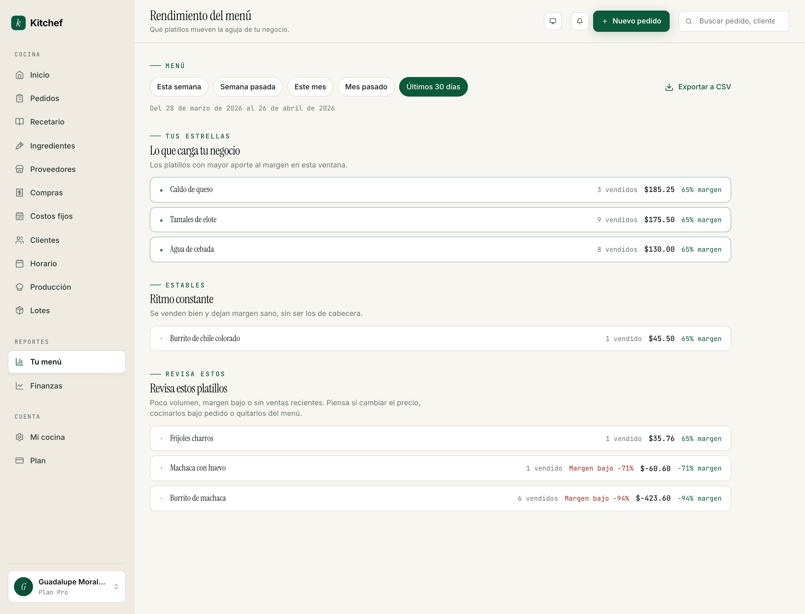
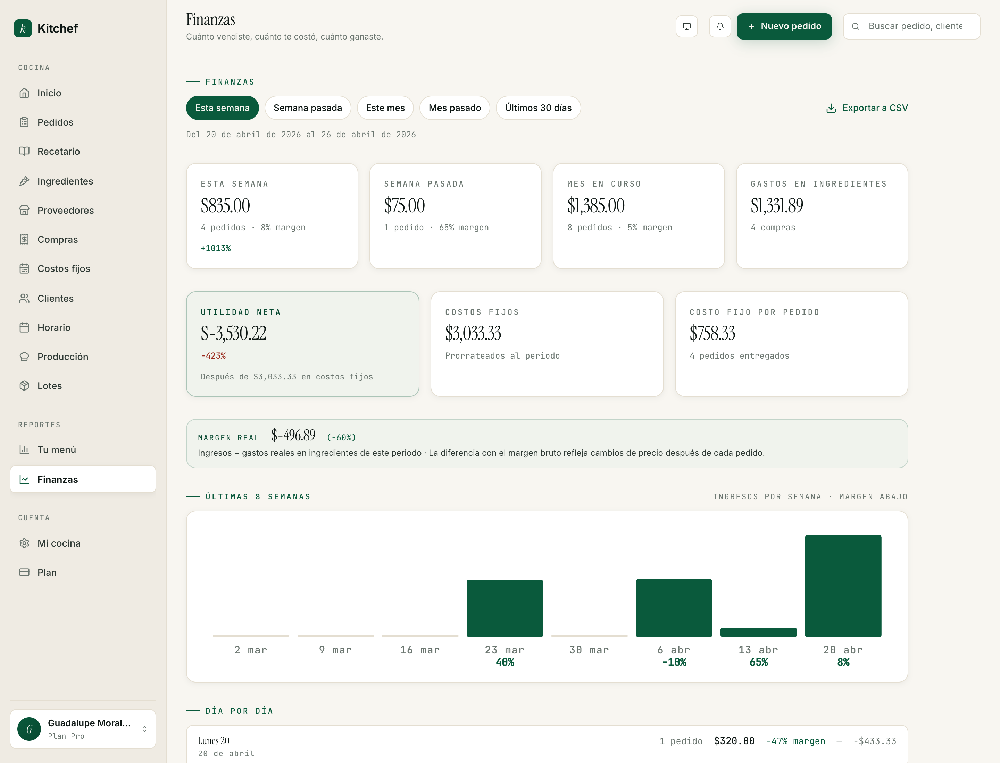

# 11 · Reportes

[← Volver al índice](README.md) · Anterior: [Inventario y lotes](10-inventario-y-lotes.md) · Siguiente: [Clientes →](12-clientes.md)

---

## Para qué sirve

Hasta aquí, Kitchef te ayudó a **operar**: capturar pedidos,
cocinar, entregar, cobrar. Reportes es el otro lado: te ayuda a
**entender**.

Hay dos reportes:

- **Tu menú** (`/reports/menu`) — qué platillos te dejan más, cuáles
  están perdiendo, cuáles vender más. Es la matriz que te dice
  qué empujar.
- **Finanzas** (`/reports/finance`) — cuánto vendiste, cuánto
  gastaste, cuánto te quedó al final. Es tu **utilidad neta**.

## Cuándo usarlos

- **Cada lunes** o cada inicio de semana — para revisar la semana
  pasada y planear la siguiente.
- **Antes de subir un precio** — para ver el margen actual.
- **Cuando algo se siente raro** — *"sentí que vendí mucho pero
  estoy en cero"*. Finanzas te dice por qué.

No es una pantalla diaria.

## Tu menú — matriz de rendimiento



Esta pantalla agrupa tus platillos en **tres bandas** según
margen y volumen:

### 1. Tus estrellas — *"lo que carga tu negocio"*
Platillos con mejor margen y mejor volumen. Estos son los que
**deberías promover**: en tu storefront, en tus stories, en tus
recomendaciones de boca.

### 2. Estables — *"ritmo constante"*
Margen razonable, ventas decentes. No te roban dinero pero tampoco
son la estrella. Mantenlos.

### 3. Revisa estos platillos
Margen bajo o ventas bajas. Aquí caen tres tipos:
- **Margen bajo (negativo o cercano a 0)** — los estás vendiendo
  perdiendo dinero. Sube el precio o cambia la receta.
- **Sin ventas recientes** — quizás no se ven en tu menú, o no
  hay demanda. Considera quitarlos.
- **Ambos** — fuerte candidato para archivar.

### Ventanas de tiempo

Arriba tienes filtros por ventana:
- **Esta semana** (lun-dom actual).
- **Semana pasada**.
- **Este mes**.
- **Mes pasado**.
- **Últimos 30 días** (default).

### Cómo se calcula el margen

Para cada platillo:

```
margen % = (precio_de_venta - costo) / precio_de_venta × 100
```

Donde `costo` viene de la receta descompuesta (capítulo 4). Si
no descompusiste tus recetas, los márgenes muestran $0 / 0% y
el reporte no es útil — descompón primero.

### Exportar a CSV

Botón arriba a la derecha. Te baja un archivo con todos los
platillos del periodo, sus ventas, su costo y su margen, listo para
abrir en Excel.

## Finanzas — utilidad neta



Esta pantalla te da el **número que importa al final**: cuánto
ganaste de verdad, después de todo.

### Los KPIs (arriba)

Cuatro tarjetas:

1. **Esta semana / mes** — ventas brutas, número de pedidos,
   margen promedio.
2. **Semana / mes pasado** — para comparar.
3. **Mes en curso** — acumulado.
4. **Gastos en ingredientes** — total de tus compras del periodo.

### Utilidad neta (la cifra grande)

```
Utilidad neta = Ventas − Costos variables − Costos fijos prorrateados
```

Donde:
- **Ventas** — total cobrado en pedidos del periodo.
- **Costos variables** — ingredientes que entraron en esos pedidos
  (suma del `unit_cost_cents` snapshotted en cada item).
- **Costos fijos prorrateados** — la parte de tu renta, gas,
  plataformas que toca a los días del periodo (mensual / 30 × días).

Si tu utilidad neta es **negativa**, significa que estás en pérdida
en ese periodo. No es siempre malo (si arrancaste y aún no
recuperaste la inversión inicial), pero es un foco amarillo.

### Margen real

Otro renglón:

```
Margen real = Ingresos − gastos reales en ingredientes
```

Es **distinto** del margen promedio del menú. El menú asume el
costo capturado en la receta; el margen real toma lo que **de
verdad** pagaste por los ingredientes en compras durante ese
periodo. La diferencia te dice si tu cocina está siendo más
eficiente o menos eficiente que tu receta teórica.

### Costo fijo por pedido

```
Costo fijo por pedido = Costos fijos prorrateados / pedidos entregados
```

Te dice cuánto te cuesta **prender la cocina** por cada pedido. Si
es más alto que tu margen variable promedio, estás perdiendo en
cada pedido — necesitas más volumen.

### La gráfica de últimas 8 semanas

Muestra ingresos por semana en barras, con el margen abajo de
cada una. Dos cosas que ver:
- ¿Las barras suben o bajan? (Tendencia.)
- ¿El margen es estable? Si baja semana a semana sin que bajen
  las barras, algo cambió en tus costos.

### Tabla "Día por día"

Detalle del periodo: cada día con su número de pedidos, ventas,
margen porcentual, y utilidad neta. Útil para entender qué días
son tus fuertes y cuáles los flojos.

### Exportar a CSV

Para llevarlo a tu contador o para tu propia hoja de cálculo.

## Cómo leer estos reportes en la práctica

### Cada lunes — 5 minutos

1. Abre **Tu menú**, ventana "Semana pasada".
2. Mira la sección **Tus estrellas** — ¿son las que esperabas?
3. Mira **Revisa estos platillos** — ¿qué hago con éstos?
4. Cambia a **Finanzas**, ventana "Semana pasada".
5. Mira **Utilidad neta** — ¿estoy contenta con eso?
6. Si está roja: revisa la columna "Día por día" para ver qué día
   te tiró abajo.

### Cuando vas a subir un precio

1. Abre **Tu menú**, ventana "Mes pasado".
2. Mira el margen actual del platillo.
3. Calcula: si subo $X, mi margen sube de Y% a Z%.
4. Súbelo desde `/recipes/<slug>/edit`.
5. La próxima semana, regresa al reporte y compara.

### Cuando algo se siente mal

1. **Finanzas → Utilidad neta** te dice si la cifra final está mal.
2. Compara contra periodos anteriores — ¿es nueva la baja?
3. **Tus estrellas** vs platillos vendidos — ¿cambió el mix?
4. **Gastos en ingredientes** — ¿gastaste más sin vender más?
5. **Costo fijo por pedido** — ¿bajó el volumen?

## Lo que NO miden estos reportes

- **El tiempo que tomas cocinando.** No hay reporte de "cuánto
  tardaste". Eso lo cuidas tú.
- **La satisfacción del cliente.** No hay encuestas integradas.
- **El churn de clientes.** Ves clientes en `/clients` (capítulo 12)
  pero no quién dejó de pedir.
- **Tu salario implícito.** La utilidad neta no separa "lo que te
  pagas tú" del resto. Si quieres llevarlo, captúralo como costo
  fijo.

## Errores comunes

| Pasó esto | Hacer esto |
|---|---|
| Tu menú me muestra todos los platillos en "Revisa estos". | No has descompuesto las recetas. Sin descomposición no hay costo, sin costo no hay margen. Capítulo 4. |
| Mi utilidad neta es enorme pero estoy quebrada. | Probablemente no has capturado costos fijos. Captura renta, gas, plataformas en `/fixed-costs`. |
| Los números no cuadran con mi banco. | Kitchef registra lo que tú marcas como pagado. Si cobras pero no marcas pagado, no aparece. |
| Mi mes pasado está vacío. | El reporte cuenta pedidos **entregados** en ese periodo, no recibidos. Si entregaste todo este mes, el mes pasado se ve flaco. |

## Próximos pasos

- **[Capítulo 5 — Ingredientes y costos](05-ingredientes-y-costos.md)**
  para asegurar que los datos que alimentan estos reportes están
  bien capturados.
- **[Capítulo 4 — Recetas avanzadas](04-recetas-avanzadas.md)** si
  Tu menú te muestra todo en "Revisa estos" — necesitas descomponer
  primero.

---

[← Volver al índice](README.md) · Anterior: [Inventario y lotes](10-inventario-y-lotes.md) · Siguiente: [Clientes →](12-clientes.md)
