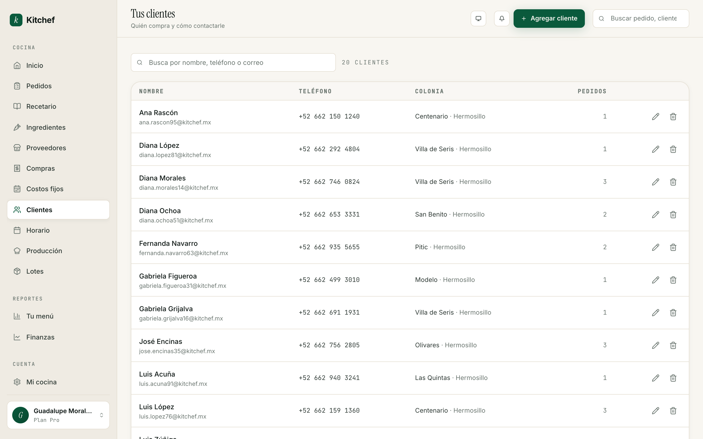

# 12 · Clientes

[← Volver al índice](README.md) · Anterior: [Reportes](11-reportes.md) · Siguiente: [Tu plan →](13-plan.md)

---

## Para qué sirve

Tu lista de clientes. Cada cliente tiene nombre, teléfono, correo,
y el historial de cuántos pedidos te ha hecho. Sirve para:

- **Recapturar pedidos repetidos** — *"Doña Marisol siempre pide
  lo mismo"*. Lo encuentras en segundos.
- **Mandar WhatsApp con un toque** — sin tener que copiar y pegar
  el número.
- **Saber quién es tu cliente recurrente** — los que más te han
  pedido aparecen primero.

## Cuándo usarla

- **Cuando capturas un pedido a mano** — eliges el cliente
  existente o lo creas en el momento.
- **Cuando un cliente te escribe por WhatsApp** — buscas su
  historial para recordar qué le gusta.
- **Cuando quieres mandarle algo** — un mensaje de "abro mañana",
  un menú especial, un recordatorio.

No es una pantalla diaria.

## La lista de clientes



Cada cliente es una fila con:

- **Nombre y apellido**.
- **Teléfono** (en formato +52 668 123 4567).
- **Correo** (si te lo dejó al ordenar por la tienda pública).
- **Pedidos** — número total que te ha hecho, con un mini-link
  *"Ver pedidos"*.
- **Último pedido** — fecha del más reciente.
- **Botones**: Editar, WhatsApp, Eliminar.

Arriba hay un buscador. Acepta nombre parcial, teléfono parcial,
o correo. Útil cuando ya tienes 50+ clientes.

## Agregar un cliente

Tres formas:

### 1. Manualmente desde `/clients`
1. Botón **Agregar cliente**.
2. Captura nombre, apellido, teléfono.
3. (Opcional) correo, RFC, notas.
4. Guarda.

### 2. Inline al capturar un pedido
En el formulario de **+ Agregar pedido**, en el campo "Cliente",
escribe un nombre nuevo y aparece *"Crear cliente"*. Te abre un
mini-form con sólo lo esencial.

### 3. Automáticamente desde la tienda pública
Cuando un cliente nuevo ordena por `kitchef.mx/tu-cocina`, se
crea automáticamente con los datos que capturó: nombre, teléfono,
correo. Al siguiente pedido, lo reconocemos por **teléfono** y
no creamos duplicado.

## Buscar / filtrar

El buscador acepta:

- **Nombre parcial** — *"mar"* encuentra Marisol, Mariana, Marco.
- **Teléfono parcial** — los últimos 4 dígitos suelen bastar.
- **Correo parcial** — *"@gmail"* filtra todos los Gmail.

La lista muestra los **clientes recurrentes primero** (los que más
te han pedido en los últimos 90 días).

## El detalle de un cliente

Toca un cliente y abres su drawer. Ves:

- Datos completos.
- **Historial de pedidos** — cada pedido con fecha, items, total,
  estado (entregado / pagado / cancelado).
- **Total gastado** acumulado.
- **Ticket promedio**.
- **Días desde el último pedido**.

Útil cuando estás por mandarle un WhatsApp y quieres recordar
qué le gustó la última vez.

## WhatsApp deep link

Cada fila tiene un ícono de WhatsApp. Al tocarlo, te abre WhatsApp
(web o app) con un mensaje pre-llenado:

```
Hola Marisol, te escribo de Cocina Doña Lupita.
```

Puedes editar el mensaje antes de mandarlo. Si tienes un mensaje
estándar para confirmaciones, ahorras minutos al día.

## Editar un cliente

- Cambiar nombre o teléfono — útil si capturaste mal.
- Agregar correo si te lo da después.
- Notas — *"prefiere recoger los sábados"*, *"alérgica a nueces"*.
  Sólo las ves tú.

## Eliminar un cliente

Botón **Eliminar** (ícono basurero). Pide confirmación. Lo que
pasa:

- El cliente se marca como eliminado (soft delete).
- Sus pedidos **no se borran** — siguen en tu kanban / historial,
  pero su nombre aparece como *"Cliente eliminado"*.
- Si vuelves a recibir un pedido del mismo teléfono, te crea un
  cliente nuevo (no recuperamos el viejo).

> **Tip:** Si quieres "ocultar" un cliente sin perder el
> historial, mejor agrega una nota *"Inactivo"* y dejalo. La
> lista se ordena por recencia, así que se va al fondo solo.

## RFC para facturar

Si tu cliente te pide factura, captura su RFC en el campo
correspondiente. Kitchef **no genera facturas todavía** — el RFC
es para tu propio control y para cuando integremos con un
facturador.

## Privacidad y datos

Tus clientes son **tuyos**. Sus datos:
- No se comparten con otras cocinas en Kitchef.
- No se usan para marketing externo.
- No se venden.
- Si exportas a CSV, te bajas todo en limpio.

## Errores comunes

| Pasó esto | Hacer esto |
|---|---|
| Tengo el mismo cliente capturado dos veces. | Usualmente pasa por teléfonos sin formato. Edita uno con el formato correcto y elimina el otro. Los pedidos del eliminado quedan como "cliente eliminado" — recaptúralos al cliente bueno si te importa. |
| Mi cliente no recibe el correo. | Revisa su correo en el detalle — quizás está mal capturado. |
| El WhatsApp no abre. | Tu cliente probablemente no tiene WhatsApp en ese número. Llámalo o pide otro número. |
| Quiero mandar el mismo mensaje a 30 clientes. | Por ahora no hay mass-WhatsApp. Hazlo por listas / etiquetas en tu app de WhatsApp Business. |

## Lo que NO necesitas tocar

- **El campo "ID interno" (`cli_xxx`)** — se genera solo. Sólo
  importa si lo necesitas para soporte.
- **Notas** si no las usas. No tiene problema dejarlas vacías.
- **RFC** si nunca facturas.

## Próximos pasos

- **[Capítulo 7 — Pedidos](07-pedidos.md)** para ver cómo se
  conectan los clientes con sus pedidos.
- **[Capítulo 8 — Tu tienda en vivo](08-tienda.md)** para ver cómo
  los clientes nuevos se crean automáticamente al ordenar.

---

[← Volver al índice](README.md) · Anterior: [Reportes](11-reportes.md) · Siguiente: [Tu plan →](13-plan.md)
