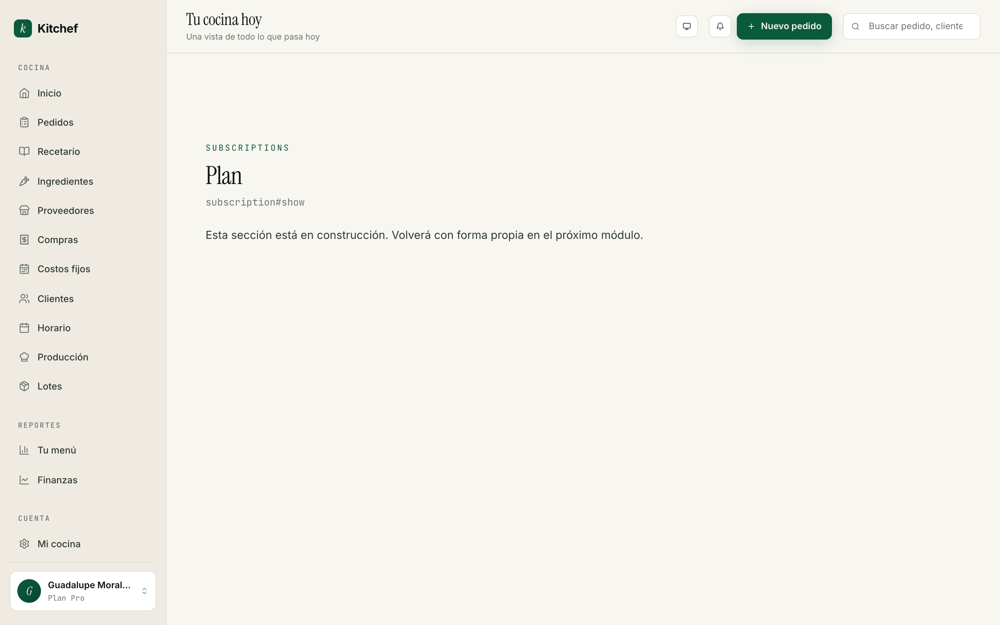

# 13 · Tu plan

[← Volver al índice](README.md) · Anterior: [Clientes](12-clientes.md)

---

## Para qué sirve

Kitchef tiene dos planes — Gratis y Pro. Esta pantalla te dice en
cuál estás, qué incluye, y cómo cambiar.

## Cuándo usarla

- **Una sola vez** — al decidir si pasarte a Pro.
- **Cuando renueves o canceles** la suscripción.

No es una pantalla diaria.

## La prueba Pro · 14 días gratis

Cuando creas tu cuenta, arrancas con una **prueba Pro de 14 días**
sin tarjeta de crédito. Durante esos 14 días tienes acceso a todo:
pedidos ilimitados, inventario, reportes avanzados, recetas con
desglose de costo.

Al terminar la prueba, tu cuenta pasa automáticamente al plan
**Gratis**. No te cobramos, no te pedimos tarjeta, no te
bloqueamos. Simplemente se ocultan las funciones Pro y sigues
operando con el plan Gratis.

## Los dos planes

### Gratis · $0 / mes

Para arrancar y probar. Incluye:
- Tu storefront completo (kitchef.mx/tu-cocina).
- Hasta **40 pedidos al mes**.
- Recetario completo.
- Kanban de pedidos.
- Producción + lista de compras.
- Reportes básicos.
- Soporte por correo.

**Limitación principal:** 40 pedidos al mes. Cuando te acerques al
límite (alrededor del pedido 35), Kitchef te muestra un aviso
suave. Al llegar a 40, te invita a pasarte a Pro para continuar.

### Pro · $199 / mes o $1,990 / año

Para cocinas que ya rodaron. Incluye todo lo del plan Gratis, sin
límite de pedidos, **más**:

- Pedidos ilimitados.
- Inventario y lotes (capítulo 10) — sólo disponible en Pro.
- Reportes avanzados (Tu menú con segmentación, Finanzas con
  utilidad neta).
- Costos fijos (capítulo 5).
- Recetas avanzadas con desglose de costo.
- Exportar a CSV.
- Soporte por WhatsApp.
- Sin marca "Hecho con Kitchef" en tu storefront.

Dos modalidades de pago:

| Modalidad | Precio | Ahorro |
|---|---|---|
| **Mensual** | $199 MXN / mes | — |
| **Anual** | $1,990 MXN / año | 2 meses gratis (~17% de descuento) |

> **Sin comisión por venta — siempre.** Kitchef nunca te cobra un
> porcentaje de lo que vendes. La cuota es el único costo.

## Cómo se ve la pantalla

Vive en `/subscription`. Te muestra:

1. **Tu plan actual** con un badge (Gratis, Pro Mensual, o Pro
   Anual).
2. **Días restantes de prueba** (si estás en periodo de prueba).
3. **Próxima factura** (si estás en Pro) con fecha y monto.
4. **Botón** que cambia según el contexto:
   - Gratis → **Pásate a Pro**.
   - Pro → **Cancelar plan**.
5. **Historial de pagos** (si tuviste algunos) con descarga de
   recibo.

## Cómo pasarte a Pro

1. Ve a **Plan** en el menú lateral.
2. Toca **Pásate a Pro**.
3. Elige **Mensual** ($199/mes) o **Anual** ($1,990/año).
4. Te lleva a Stripe Checkout — captura tarjeta.
5. Confirmas.
6. Stripe te cobra; tu cuenta queda en Pro al instante.

Los cambios son inmediatos:
- La sección **Funciones avanzadas** en `/account/edit` queda
  desbloqueada.
- El recordatorio de "40 pedidos" desaparece.
- Los reportes muestran las gráficas completas.

> **Pago seguro:** Kitchef nunca toca tu tarjeta. La maneja Stripe
> directamente. Si tu tarjeta cambia, lo actualizas en Stripe (te
> mandamos un link al cambiar).

## Cómo cancelar Pro

1. Ve a **Plan**.
2. Toca **Cancelar plan**.
3. Confirma.

Lo que pasa:
- Sigues en Pro hasta que termine el periodo ya pagado.
- No te volvemos a cobrar.
- Cuando termine, pasas automáticamente a Gratis.
- Tus datos quedan intactos. Tu storefront sigue funcionando.
- Las funciones Pro (inventario, reportes avanzados) se ocultan
  pero no se borran. Si vuelves a Pro, todo está donde lo dejaste.

> Si cancelas dentro de las primeras 24 horas del primer pago,
> contacta soporte para reembolso completo.

## Facturación

Stripe genera la factura cada mes (o cada año si elegiste anual).
Si necesitas factura fiscal en México (CFDI), por ahora no la
generamos automáticamente — pídela a soporte con tu RFC y razón
social.

## Errores comunes

| Pasó esto | Hacer esto |
|---|---|
| Terminó mi prueba y no puedo ver el inventario. | Al terminar la prueba pasas a Gratis. Para recuperar el inventario, pásate a Pro. Tus datos siguen ahí. |
| Pasé a Pro pero el inventario no aparece. | Ve a `/account/edit` y activa el toggle **Inventario y lotes**. Pro habilita la opción; tú decides cuándo activarla. |
| Mi tarjeta venció. | Stripe te avisa por correo. Actualiza tu tarjeta en el portal de Stripe (link en el correo). |
| Cancelé y se borró todo. | No se borra nada. Vuelve a Pro y todo regresa. |
| El cobro no llegó pero estoy en Pro. | Stripe a veces tarda en cobrar (1-3 días). Si pasan 5 días sin cobro, contacta soporte. |

## Cuándo pasarte a Pro

Pásate cuando:

- Pasaste de 40 pedidos al mes (la propia pantalla te avisa).
- Vas a activar inventario.
- Quieres ver utilidad neta y márgenes detallados.
- Tu tiempo de soporte vale más que $199/mes.

No te apresures. Si llevas 10 pedidos al mes, Gratis te sobra.

## Próximos pasos

- **[Volver al índice](README.md)** — has terminado el manual.
  ¡Felicidades!

---

[← Volver al índice](README.md) · Anterior: [Clientes](12-clientes.md)
