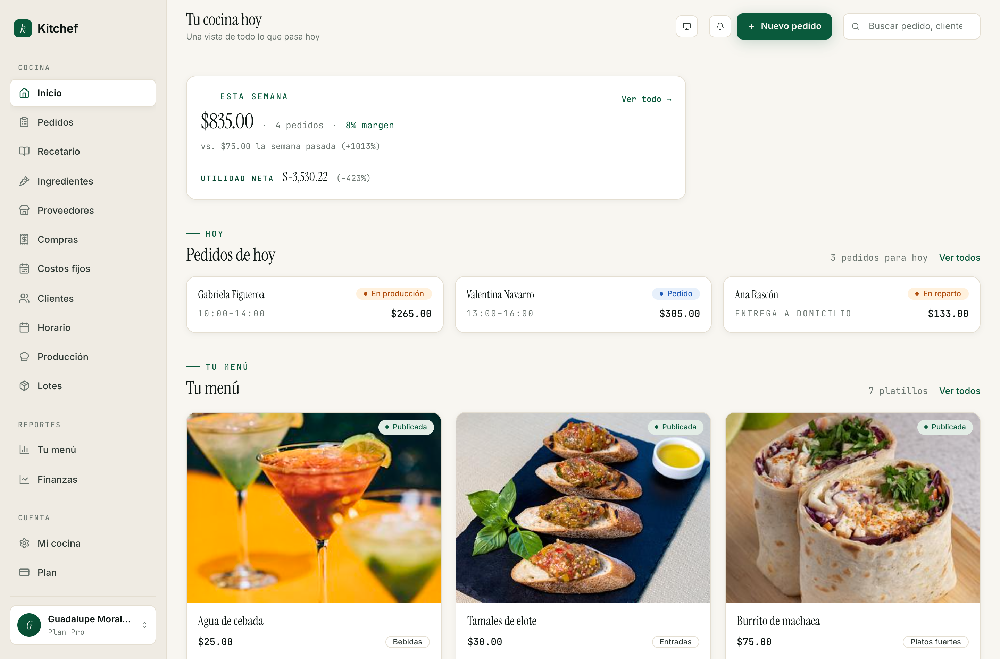

# Manual de operaciones · Kitchef

Esta es la guía completa para usar Kitchef en tu cocina. Está pensada
para una persona — la cocinera, el cocinero, quien lleva la operación
del día a día. Si vas empezando, lee del 1 al 4 en orden. Después
puedes saltar al capítulo que necesites cuando lo necesites.

Cada capítulo tiene tres partes:

- **Para qué sirve** — qué problema resuelve esta parte de Kitchef.
- **Cuándo usarla** — el momento del día o de la semana en que aplica.
- **Cómo se hace** — los pasos concretos, con los nombres y rutas
  reales del panel.

No tienes que aprenderte todo de memoria. La idea es que tengas a la
mano una referencia clara y que no te quedes atascada en ningún paso.

## Índice

### Para empezar
1. [Bienvenida y primeros pasos](01-bienvenida.md) — qué es Kitchef, cómo se ve tu panel, tu primera media hora.
2. [Tu cocina pública](02-cocina-publica.md) — identidad, logo, portada, paletas, métodos de entrega, slug.
3. [Tu menú](03-menu.md) — agregar platillos en modo simple, fotos y precios, publicar.

### Cocina diaria
4. [Pedidos](07-pedidos.md) — el tablero (kanban), capturar a mano, ciclo del pedido, pagos, propinas, cancelaciones.
5. [Producción del día](09-produccion.md) — la vista de "qué cocinar hoy", lista de compras semanal.
6. [Horario](06-horario.md) — cuándo aceptas pedidos y para cuándo entregas.

### Cuando estás lista para más
7. [Recetas avanzadas](04-recetas-avanzadas.md) — descomponer recetas, opciones, recetas base.
8. [Ingredientes y costos](05-ingredientes-y-costos.md) — proveedores, compras, costos fijos, márgenes.
9. [Inventario y lotes](10-inventario-y-lotes.md) — control de stock, políticas, faltantes.
10. [Reportes](11-reportes.md) — Tu menú y Finanzas.

### Tienda y clientes
11. [Tu tienda en vivo](08-tienda.md) — cómo se ve y cómo ordenan tus clientes.
12. [Clientes](12-clientes.md) — agregar, buscar, historial, WhatsApp.

### Cuenta
13. [Tu plan](13-plan.md) — Gratis vs Pro, prueba de 14 días, precios.

## Convenciones de este manual

- **Negritas** marcan etiquetas que vas a ver tal cual en el panel.
- `Texto en gris` (con tipografía monoespaciada) marca rutas — lo que
  va después de `kitchef.mx` cuando estás en el panel.
- *Cursivas* marcan vocabulario propio del oficio.
- Las capturas son ilustrativas: tu pantalla puede verse un poco
  diferente según los datos que tengas.

## Cuando algo no funciona

Si algo se traba o ves un mensaje de error, mándale captura al equipo
de soporte. Ningún paso de este manual debería tronarte; si lo hace,
es un bug nuestro, no un error tuyo.
